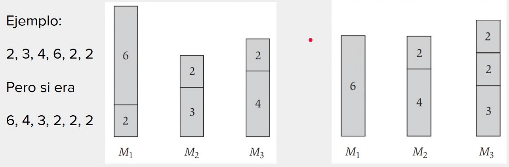
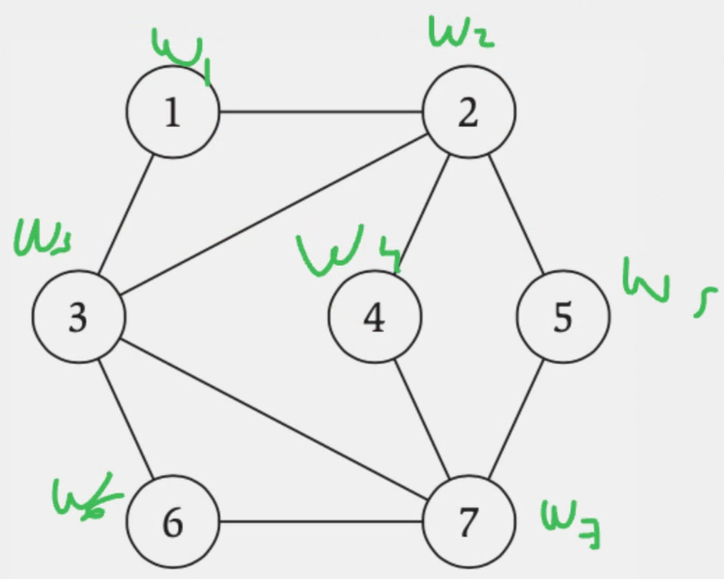
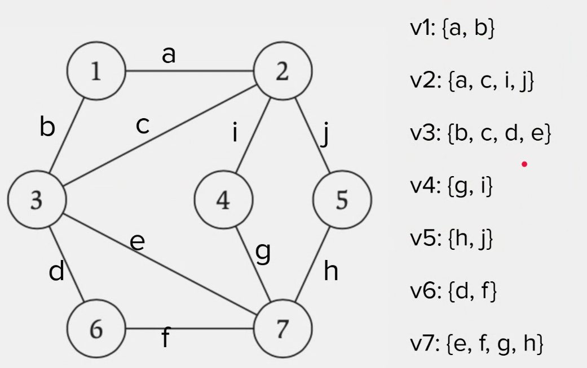
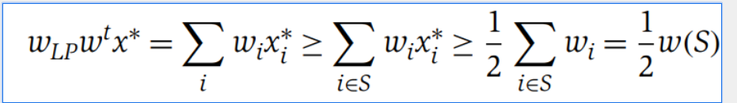
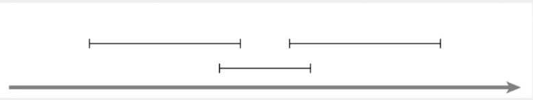

# Algoritmos de Aproximacion

## Estrategias

* Algoritmos Greedy
* Pricing Method
* Programacion Linea, Programacion Entera
* Programacion Dinamica

## Problema de Balanceo - Greedy

Dadas $m$ maquinas y un conjunto $n$ de trabajos, donde cada trabajo $j$ toma
tiempo $t_j$, se desea asignar el trabajo en las Maquinas de forma balanceada. Dada una
asignacion $A(i)$ para la maquina $i$, su tiempo de trabajo es:
$$ T_i = \sum_{j \in A(i)} t_j $$

Y queremos encontrar la asignacion que minimice el maximo valor de $T_i$. Que tambien
representa el tiempo que se tardara en finalizar todos los trabajo.

Este problema es NP-Hard.

* Iterar sobre todos los trabajos
* Para cada trabajo, asignarlo a la maquina con menos trabajo al momento

Sin embargo, esta solucion **no es optima.**

### Analisis de la solucion

* Tocaria comparar nuestra solucion $T$ con la solucion optima $T^*$.
* No conocemos la solucion optima
* La mejor asignacion posible seria repartir para cada maquina haga exactamente la misma
  cantidad de trabajo
* Ademas, nunca se puede terminar antes que el trabajo mas largo

Entonces, asumiendo que exista la solucion optima sera igual o peor que repartir todas las
maquinas de forma perfecta.
$$ T^* \geq \frac{1}{m} \sum_{j} t_j $$

Ademas, no puede terminar antes que la duracion del maximo t_j (trabajo mas largo)
$$ T^* \geq \max_{j} t_j $$

### Demostracion:

* Necesitamos comparar nuestra solucion T con lo que sabemos del optimo
* Una de nuestras Maquinas en $T$ tuvo mas carga que cualquier otra
* Habra habido un ultimo trabajo $t_j$ que se asigno a esa maquina $M_i$
* Si ese trabajo $T_j$ no es muy grande, entonces acotamos
  con $$ T^* \geq \frac{1}{m} \sum_{j} t_j $$
* Si ese trabajo $T_j$ es muy grande, entonces acotamos con $$ T^* \geq \max_{j} t_j $$

* Esta maquina $M_i$ tenia una carga $T_i$ antes de agregarle el trabajo $t_j$ y esta debe
  haber sido la menor carga entre todas. Por lo que todas las cargas restantes deben ser
  mayores o iguales a $T_i - t_j$.
* Es decir, para toda maquina $k$ en $T$, $T_k \geq T_i - t_j$.
  $$ T^* \geq \max{j} t_j \rightarrow T_i (T_i - t_j) + t_j \leq 2T^* $$
* Por lo que nuestro peor tiempop **nunca es peor** que 2 veces el optimo.

$$ T_i \leq 2T^* $$

### Ordenar

Por lo que ordenar los trabajos de mayor a menor y asignarlos en ese orden la distribucion
queda mas equilibrada.

* Si $m \geq n$, entonces la solucion es optima
* Si $n \geq m$, para estos trabajos en orden, los primeross $m+1$ trabajos cuestan lo
  mismo o mas que el trabajo $m+1$. Cualquier solucion optima debe asignar dos de esos
  trabajos a la misma maquina. Entonces $t_j \leq t_{m+1} \leq 1/2 T^*$

* Por lo que $T_i \leq 3/2 T^*$

## Problema Set Cover - Greedy

Tenemos un Set $U$ de $n$ elementos y un listado $S_1, S_2, \dots, S_m$ de subconjuntos
de $U$. Un Set Cover es una coleccion de estos subsets tal que la union de todos los
subsets sea igual a $U$. El uso de cada Subset $S_i$ tiene un costo $w_i$. Queremos
minimizar: $$ \sum_{i} w_i $$

### Algoritmo Greedy

* Empezando por el conjunto de subsets vacio
* Encontrar que subset me conviene agregar segun la proporcion: $peso / #elem$
* Iterar, recalculando la medida de progreso teniendo únicamente en cuenta aquellos
  elementos de $U$ que no se han logrado incorporar
* Completar la iteración cuando hayamos cubierto todos los elementos de $U$

### Analisis de solucion

Se puede demostrar (en el libro) que el peso obtenido es como mucho O(log n) veces el peso
de la solucion optima.

## Problema Vertex Cover - Greedy

Dado un Grafo, un vertex Cover es el minimun set de vertices tal que cada arista tiene al
menos un extremo en el set.

Podemos reducir el problema de Vertex Cover a Set Cover. Para cada vertice $i$ creo un
subset $S_i$ con los vecinos de $i$ y $i$ incluido.

## Vertex Cover: Una mejor aproximacion

Si bien ya tenemos una aproximacion por reduccion a Set Cover, se puede hacer mejor. La
siguiente aproximacion se basa en una perspectiva economica.

Pensaremos los pesos de los nodos como _costos_ a pagar por la utilizacion del nodo, y
cada arista debera pagar su
_parte_ del costo para el Vertex Cover encontrado.

Las diferentes aristas serian _agentes_ dispuestas a pagar por el nodo que las cubre

El algoritmo encuentra el VC y los precios que cada arista paga. La sumatoria de esos
precios sera el peso total de Vertex Cover Aproximado.

## Problema Vertex Cover - Programacion Lineal

Como problema de decision, podemos plantear decidir si los valores de $x$ pueden
satisfacer todas las inecuaciones definidas, y que el objetivo a minimizar sea menor a
cierto valor.

El uso de cada vertice $v_i$ tiene un costo $w_i$. Queremos minimizar $$ \sum_{i} w_i $$

* Cada variable de nuestro problema representara un vertice.
* Las ecuaciones representas las aristas. Para una arista entre vertices $x_i$, $x_j$ se
  necesita que al menos uno de los dos vertices se utilice en el VC.
* Podemos decir que cada $x_i$ vale 1 si pertenece al VC, $0$ si no. <- programacion
  lineal entera (ILP) que es NP-Hard
* Las desigualdades entonces se conformaran por las aristas del
  grafo: $$ x_i + x_j \geq 1 $$

$$ \min \sum_{i} w_i x_i $$
$$ x_i + x_j \geq 1 \forall (i, j) \in E $$
$$ x_i \in \{0, 1\} i \in V$$

**COTA**
Podemos decir que cualquier solucion de PL es mejor que la solucion optima de VC. Se dice
que $$ w_{LP} \leq w(S^*) $$.

Pero tenemos el problema de que x_i puede valer 0.3 por ejemplo.

**Criterio:**
Considerar que si $x_i \geq 0.5$ entonces lo tomamos (como $x_i = 1$).

Cualquier $x_j^* \geq 0.5$ es un VC aproximado. Por cada uno de estos $x_j^*$, cuando lo
redondeamos a 1, estamos como mucho incrementando las cosas en 1/2. Por lo tanto:

## Ejercicio Problema de Scheduling

En nuestros intentos de hacerlo greedy, surgieron al menos dos soluciones:

* La optima: ordenar por charlas que terminan antes, siempre seleccionar la que termina
  antes sin superponerse.
* La no optima: siempre seleccionar la charla mas corta sin superponerse

Analizaremos que tan buena es esta aproximacion no optima.

_Por cada charla corta elegida por este metodo, cuantas charlas largas de la solucion
optima pierdo por elegirla?_

* Si la charla corta no se superpone con ninguna otra, entonces no pierdo ninguna charla
  larga.
* Si la charla corta se superpone como mucho con 2 charlas largas.

Cada intervalo en $O$ (sol optima) puede estar tambien en $A$, o choca con un intervalo
en $A$. Contandolos asi:

* el intervalo tambien esta en $A$: 1
* $A$ tiene otro intervalo corto que choca con 2, el intervalo en $O$: 2

$\Rightarrow$ En el peor de los casos, el conjunto $A$ tiene la mitad de elmentos que $O$,
una 2-aproximacion.

## Ejercicio Matching Tridimensional

Dados sets disjuntos X,Y,Z, y conjuntos de triplas de valores en X x Y x Z, buscar el
máximo subset M que sea un Matcheo Tridimensional, es decir, que para cada elemento X U Y
U Z se encuentre dentro del Matcheo como máximo una vez.

Dar un algoritmo que encuentre una 3-Aproximación del máximo Matching Tridimensional

Ejemplo:
$$ ( 1, \alpha,a) $$
$$ ( 7, \beta, c) $$
$$ ( 1, \beta, d) $$

Solucion optima:
$$ ( 1, \alpha,a) $$
$$ ( 7, \beta, c) $$

# Aproximation MIT : INCOMPLETE [doc](https://ocw.mit.edu/courses/6-046j-design-and-analysis-of-algorithms-spring-2015/a4a7f356ba3e65a00ad2bdcfed6e0f35_MIT6_046JS15_lec17.pdf)

An algorithm for a problem of size $n$ has an approximation ratio $l(n)$ if for any input
of size $n$, the algorithm produces a solution with cost $C$ such that:
$$ max(\frac{C}{C_{opt}}, \frac{C_{opt}}{C}) $$
There is two terms because sometimes we want the maximun and sometimes the minimum.

An approximation scheme that takes as input $\epsilon > 0$ and produces a solution such
that $C = (1 + \epsilon) C_{opt}$ for any fixed $\epsilon$, is a $(1 + \epsilon)
$-approximation algorithm.

A Polynomial Time Approximation Scheme (PTAS) is an approximation algorithm that runs in
time polynomial in the size of the input, $n$. A Fully Polynomial Time Approximation
Scheme (FPTAS) is an approximation algorithm that runs in time polynomial in both $n$
and $\epsilon$. 

* For example, a $O(n^{2/\epsilon})$ approximation algorithm is a PTAS 
but not a FPTAS.
* A O(n/c2) approximation algorithm is a FPTAS.

## Vertex Cover
Given an undirected graph G(V, E), find a
subset V ' ⊆ V such that, for every edge
(u, v) ∈ E, either u ∈ V ' or v ∈ V ' (or both). Furthermore, find a V ' such that |V '|
is minimum. This is an NP-Complete problem.

