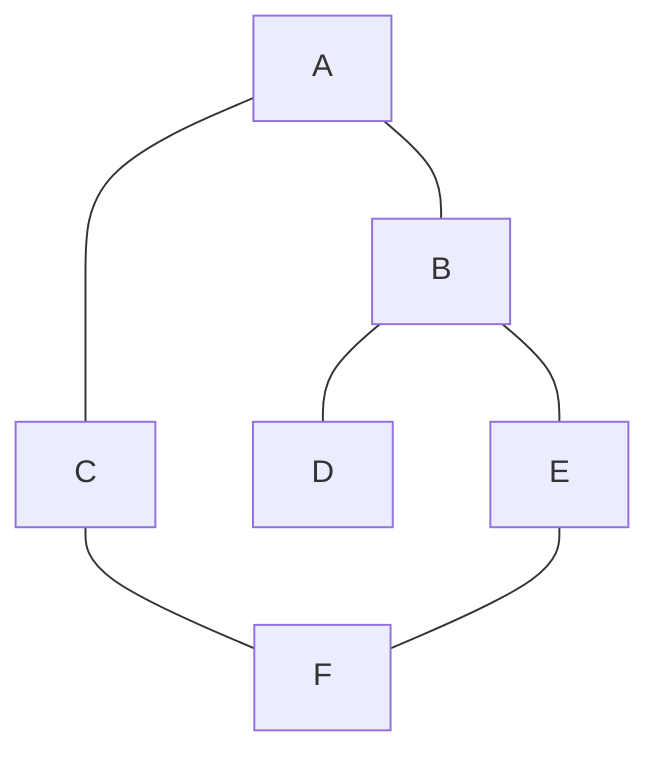
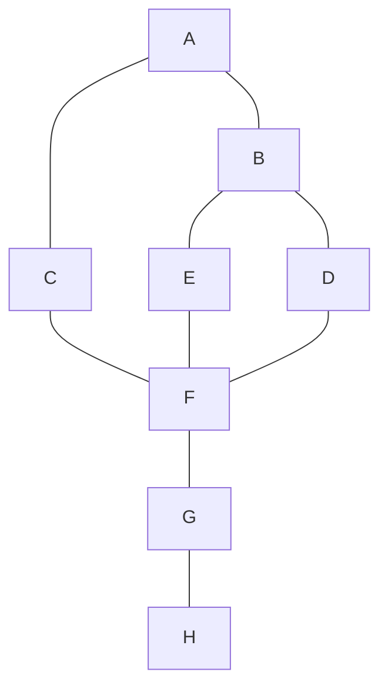
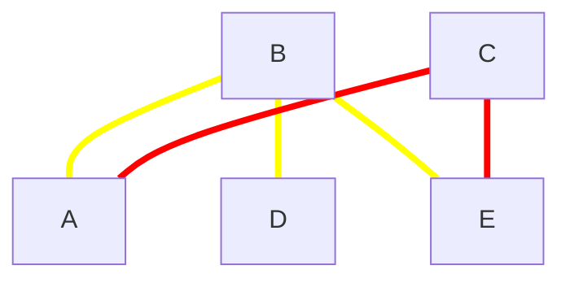
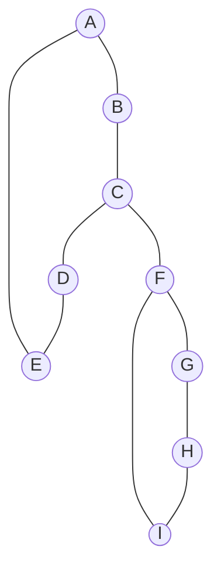

Cuando sabemos que una combinacion parcial que ya construimos no va a llevar a un resultado valido, *podamos*

Ejemplo I - N
Dado un tablero de ajedrez de NxN, ubicar (si es posible) a N reinas de tal manera que ninguna pueda *comerse* una con otra.

La idea es:

| X   |     |     |     |
| --- | --- | --- | --- |
|     |     |     |     |
|     |     |     |     |
|     |     |     |     |

Intento poner una reina en una posicion. Si la solución no trae problemas es _parcialmente válida_. Si no, es _inválida_. $\therefore$ No entretengo más esa idea. Ni ahora ni nunca más después

Ejemplo:

| X   | X   |     |     |
| --- | --- | --- | --- |
|     |     |     |     |
|     |     |     |     |
|     |     |     |     |

> Corto el análisis de este caso **y sus derivados**.

Por lo que si caigo en un caso correcto, pruebo las siguientes combinaciones desde ese punto. Pues los anteriores ya se que son *inválidos*.

| X   |     |     |     |
| --- | --- | --- | --- |
|     |     | X   | p   |
| p   | p   | p   | p   |
| p   | p   | p   | p   |
Donde p representa los casilleros no intentados aun. Luego:

| X   |     |     |     |
| --- | --- | --- | --- |
|     |     | X   |     |
|     |     |     |     |
|     | X   | p   | p   |

Finalmente se queda con 3 reinas si comienza desde la esquina superior izq.


Mejor poda: Puedo podar mas si planteo que al poner una reina en la casilla $C_{i, j}$, debo podar todos los analisis de casillas en la fila $i$ o columna $j$. Podria podar mejor si puedo podar las diagonales tmb.

| X   |     |     |     |
| --- | --- | --- | --- |
|     |     | X   |     |
|     |     |     |     |
|     | X   | p   | p   |


## Independent Set
Quiero guardar en un grafo K elementos. Debo elegir K vertices en los cuales guardar cada uno. Restriccion: Queremos ver de ubicar K elementos sin que hayan dos elementos adyacentes.

Con fuerza bruta podemos probar todas las opciones. En cada vertice ver las alternativas.

## Ejemplo de codigo que esta mal

```python
def backtracking(grafo):
	for v in grafo:
	   backtracking(grafo, v)

def backtracking(grafo, visitados):
    visitados.add(actual)
	for v in grafo:
	   if v not in visitados:
		   backtracking(grafo, v)
		   visitados.remove(v)
```

## Camino Hamiltoniano
Visita todos los vertices del grafo una sola vez.

## Problema de Coloreo de grafos
Dado un grafo y K colores diferentes, es posible pintar los vertices de tal forma que ningun par de vertices adyacentes tengan el mismo color?

### Estrategia general
1. Si ya encontre solucion, la devuelvo y termino
2. Avanzo si puedo
3. Pruebo si la solucion parcial es valida
	1. Si no lo es, retrocedo y vuelvo a 2.
	2. Si lo es, llamo recursivamente y vuelvo a 1
4. Si llegue hasta aca, ya probe con todo y no encontre una solucion.

El prosacodigo:
1. Si todos los paises estan coloreados, devuelvo `True`
2. Pruebo colrear con un color el siguiente pais
3. Verifico si la solucion parcial es valida.
	1. Si no lo es, retrocedo y vuelvo a probar con otro color
	2. Si lo es, llamo recursivamente y vuelvo a 1 -> Si no encontramos solucion, volvemos a 2 a probar con otro color
4. Si llego aca, no hay solucion





## Problema de las reinas

| X     |    |    |    |
|-------| -- |----| -- |
| <br/> |    |    |    |
| <br/> |    |    |    |
| <br/> |    |    |    |

| X     | |   |   |
|-------|-|---| - |
|       | | X |   |
| <br/> | |   |   |
| <br/> | |   |   |

No puede mas, vuelve a la fila 2

| X     | |   |   |
|-------|-|---|---|
|       | |   | X |
| <br/> | |   |   |
| <br/> | |   |   |

| X     |   |   |   |
|-------|---|---|---|
|       |   |   | X |
| <br/> | X |   |   |
| <br/> |   |   |   |

No puede mas, vuelve a la fila 1

|       | X |   |   |
|-------|---|---|---|
|       |   |   |   |
| <br/> |   |   |   |
| <br/> |   |   |   |

|       | X |   |   |
|-------|---|---|---|
|       |   |   | X |
| <br/> |   |   |   |
| <br/> |   |   |   |

|       | X |   |   |
|-------|---|---|---|
|       |   |   | X |
| X     |   |   |   |
| <br/> |   |   |   |

# Vertex Cover



B - C

Paso 1: Toca a B y C
Paso 2: Toca a B 


Ejemplo

