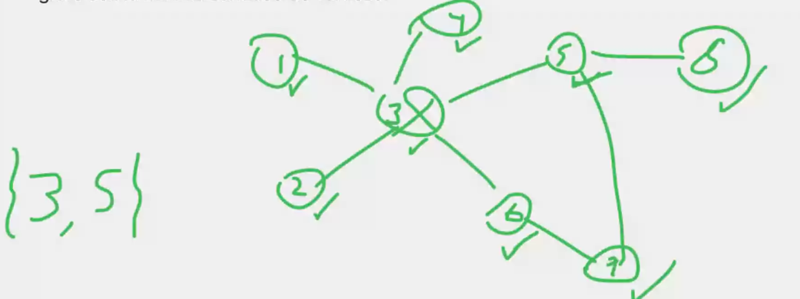

# Dominating Set

Un set dominante (Dominating Set) de un grafo F es un subconjunto **D** de vertices de G, tal que para todo vertice de
G:
o bien

i. pertenece a D;

ii. es adyacente a un vertice en D.

Implementar un algoritmo que reciba un Grafo, y devuelva un dominating set de dicho grafo con la minima cantidad de
vertices 



### Estrategia general
1. Si ya encontre solucion, la devuelvo y termino
2. Avanzo si puedo
3. Pruebo si la solucion parcial es valida
    1. Si no lo es, retrocedo y vuelvo a 2.
    2. Si lo es, llamo recursivamente y vuelvo a 1
4. Si llegue hasta aca, ya probe con todo y no encontre una solucion.

1. no queda ninguno por tocar
2. pongo a este, 
3. Si este desbloqua, lo incluyo y sigo
4. Si no desbloquea, no lo incluyo y sigo por otro vertice
5. Si llegue hasta aca, no encontre sol

```python


```