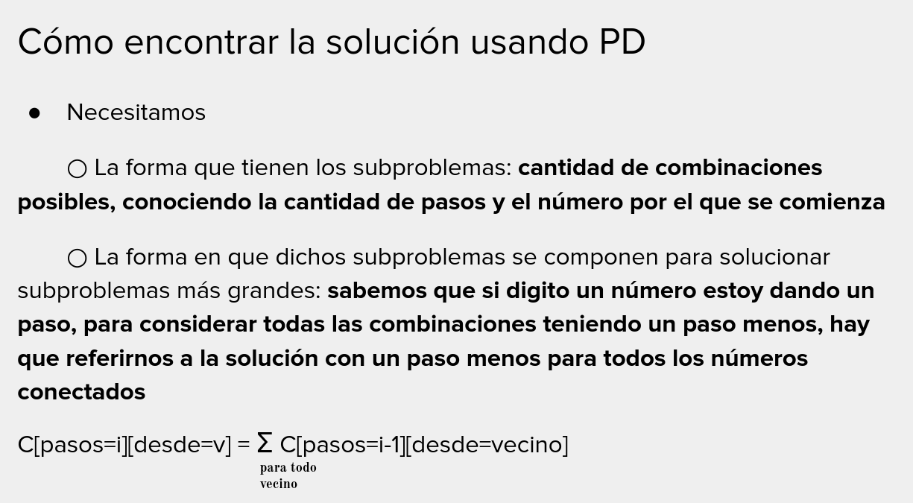

Juan es ambicioso pero también algo vago. Dispone de varias ofertas de trabajo diarias, pero no quiere trabajar dos días
seguidos. Dado un arreglo con el monto esperado a ganar cada día, determinar por programación dinámica el máximo monto a
ganar, sabiendo que no aceptará trabajar dos días seguidos.
Si Juan quiere planificar su semana, tendríamos un arreglo con los montos esperados para los 5 días laborables. ¿Cuales
son los mejores días en los que Juan puede trabajar respetando nuestra sagrada ley de mínimo esfuerzo?

```python
def juan_el_vago(M, dias):
    G = [0] * dias
    G[0] = M[0]
    G[1] = max(M[1], M(0))

    for d in range(2, dias):
        G[d] = max(G[d - 1], G[d - 2] + M[d])

    return G[dias - 1]
```

```python
def construir_elecciones(G, M):
    elecciones = []
    d = len(G) - 1
    while (d >= 0):
        opt_ayer = G[d - 1] if d > 0 else 0
        opt_anteayer = G[d - 2] if d > 1 else 0
        valor_hoy = M[d]
        if valor_hoy + opt_anteayer >= opt_ayer:
            elecciones.insert(0, d)
            d -= 2
        else:
            d -= 1

    return elecciones
```

## Ejercicio: Caminos posibles

Dado un laberinto representado por una grilla, queremos calcular la cantidad de caminos posibles que existen para llegar
desde la posición (0,0) hasta la posición NxM
Los movimientos permitidos son, desde la esquina superior izquierda (el 0,0), nos podemos mover hacia abajo o hacia la
derecha.

Mov[N,M] = Mov[N-1, M] + M[N, M-1]


## Ejercicio: Caminos a traves del teclado del telefono

Dado el teclado numérico de un celular, y un número inicial k, encontrar la cantidad de posibles números de longitud N
empezando por cierto botón. Restricción: solamente se puede presionar un botón si está arriba, abajo, a izquierda, o
derecha del botón actual.



