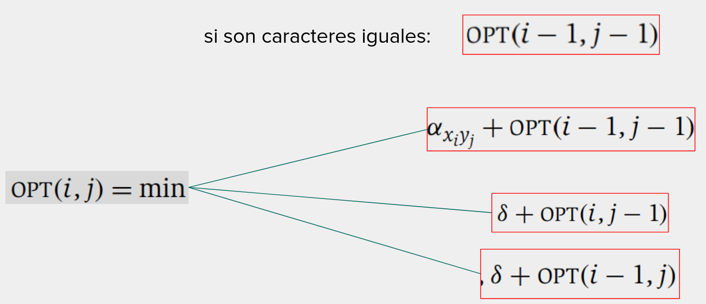

# Distancia de edición

* `Alimiasmiento`
* `Alineamiento`

Se define que el mejor alineamiento entre dos cadenas es aquel que minimice la Distancia de edicion. El criterio sera:

* Por cada par de letras que coincide en el alineamiento, no hay costo.
* Existe la penalidad $\delta$ que se refiere a no alinear las leras. Una brecha (gap).
* Por cada par de letras $a_i$ y $b_j$ que no coinciden. Por ejemplo, el costo al alinear $V$ y $B$ puede ser bajo,
para considerar su parecido y cercanía en el teclado. \alpha(q,w) = 1

Ejemplo: ocurrenya y occurancia

```
oc-urrencia
occurrancia
```
Costo: $\delta + \alpha (e,a)$

```
oc-urre-ncia
occurr-ancia
```

Costo: $3\delta$

Podemos pensar, arbitrariamente, que el algoritmo trata las cadenas de atras hacia adelante. Por lo tanto, podemos evaluar como se verian las distintas opciones de solucion.

* Si el ultimo caracter de ambas cadenas coinicide, entonces no hay costo. Luego, hay que calcuar una solucion optima para lo que resta de cadena.

Ejemplo I: alinear _oros_ y _lobos_ tiene el mismo costo que alinear _oro_ y _lobo_.

* Caso contrario, decidir realizar un reemplazo de costo $\alpha (xi,yj)$. Luego, se deberá calcular una solución óptima, utilizando un carácter menos de cada cadena.

Ejemplo II: alinear caso y casa. Se paga el costo de reemplazo entre o y a, luego se calcula el alineamiento óptimo con un carácter menos de cada cadena: cas y cas

* Podríamos introducir una brecha en alguna de las dos cadenas. Dependiendo de en qué cadena se introduce la brecha, se deberá luego calcular la correspondiente solución óptima considerando los caracteres correctos de cada cadena.

Ejemplo III: alinear casa y cases ( casa- con cases )
Una opción de brecha podría ser dejar una brecha en la palabra casa (alinear - con s) y luego calcular el alineamiento óptimo entre casa y case.
en ese caso, hay que considerar el costo de la brecha, y calcular el alineamiento óptimo entre la totalidad de la primera cadena, y los caracteres de la segunda cadena excepto el último,

* Podríamos introducir una brecha en alguna de las dos cadenas. Dependiendo de en qué cadena se introduce la brecha, se deberá luego calcular la correspondiente solución óptima considerando los caracteres correctos de cada cadena.
Ejemplo IV: alinear bates y bata ( bates con bata- ).
  Una opción de brecha podría ser dejar una brecha en la palabra bata (alinear - con s) y luego calcular el alineamiento óptimo entre bate y bata.
  en ese caso, hay que considerar el costo de la brecha, y calcular el alineamiento óptimo entre la primera cadena menos un caracter, y todos los caracteres de la segunda cadena.

Resumen: existen 4 opciones

* Los caracteres coinciden: habrá que calcular la solución óptima para un problema definido como: i-1 en cadena X y j-1 en cadena Y.
* Reemplazar caracteres: sumar un costo y calcular la solución óptima para un problema definido como: i-1 en cadena X y j-1 en cadena Y.
* Brecha en la primera cadena: sumar un costo de brecha y calcular la solución óptima para un problema definido como: i en cadena X y j-1 en cadena Y.
* Brecha en la segunda cadena: sumar un costo de brecha y calcular la solución óptima para un problema definido como: i-1 en cadena X y j en cadena Y.



## SubsetSum

## Tu a Londres y yo a California
si L_i > C_i + M:

opt(i) = min(opt(i-1) + L_i, opt(i-1) + C_i)