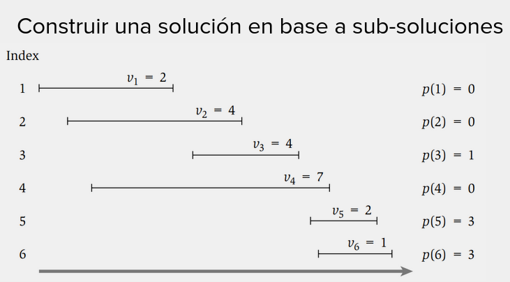
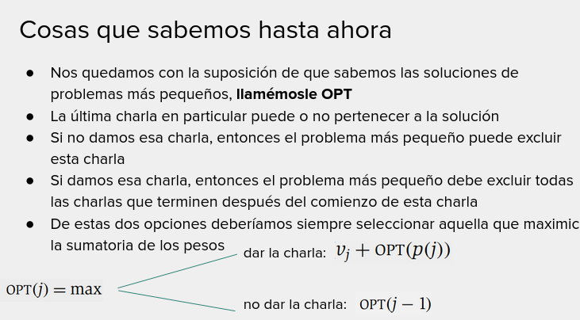

# Memoization

# Bottom Up

Iterativa

# Top Down
Recursiva:
Ejemplo Fibonacci que usa Fib(n) = Fib(n-1) + Fib(n-2) usando memoization si se puede

```python
def fib(n, memo):
    if memo[n]:
        return memo[n]
    if n == 1:
        return 1
    elif n == 0:
        return 1
    
    return fib(n-1) + fib(n-2)
        
def fib(n):
    memo = [None] * n
    return fib(n, memo)
```

En catedra:
```python
def fib_memorioso(n):
   M_FIB = [None] * (n+1)
   return fib_rec_memorioso(n, M_FIB)

def fib_rec_memorioso(n, M_FIB):
   if n == 0:
       return 0
   if n == 1:
       return 1
   if M_FIB[n-1] == None:
       M_FIB[n-1] = fib_rec_memorioso(n-1, M_FIB)
   if M_FIB[n-2] == None:
       M_FIB[n-2] = fib_rec_memorioso(n-2, M_FIB)
   M_FIB[n] = M_FIB[n-1] + M_FIB[n-2]
   return M_FIB[n]
```

# Schedulind de charlas con pesos



Compatibilidad: Cualquier solucion parcial $k$ que tenga su fin en $F_k$ va a ser compatible con la charla $C_j$ si
dicha charla tiene inicia $I_j >= F_k$.

Se busca encontrar, para cualquier charla $C_j$ la solucion parcial $k$ maxima con $I_j >= F_k$. Con la idea de que el
peso acumulado por la solucion parcial $k$ **sumado** al peso de la charla $C_j$ va a ser la mejor solucion posible
_hasta el momento_ que incluya a $C_j$.



Dar la charla j implica que puedo, por lo que $OPT(j) = P_j + OPT(j-1)$
No dar la charla j implica que lo mejor es lo anterior: $OPT(j) = OPT(j-1)$


Seguimiento:

$OPT(2) = P_2 + OPT(0)$ -> pues no hay charlas compatibles con la 2
$OPT(3) = P_3 + OPT(1)$ -> pues $C_2$ no es compatible con $C_3$
$OPT(4) = P_4 + OPT(0)$ -> pues $C_1$, $C_2$ y $C_3$ no son compatibles con $C_4$
$OPT(5) = P_5 + OPT(3)$ -> pues $C_3$ es la ultima charla compatible con $C_5$

|0| 1 | 2 | 3 | 4 | 5 |
|-|---|---|---|---|---|
|0| 2 | 4 | 6 | 7 | 8 |

