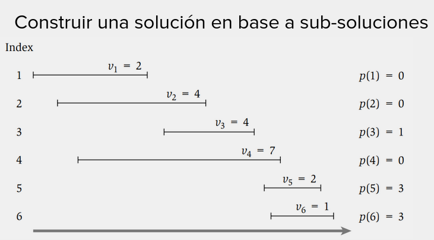
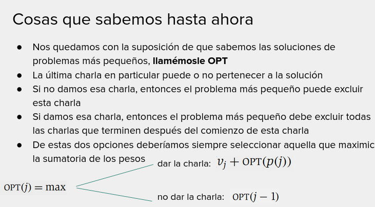

# Memoization

# Bottom Up

Iterativa

# Top Down

Recursiva

# Schedulind de charlas con pesos

Compatibilidad: Cualquier solucion parcial $k$ que tenga su fin en $F_k$ va a ser compatible con la charla $C_j$ si
dicha charla tiene inicia $I_j >= F_k$.

Se busca encontrar, para cualquier charla $C_j$ la solucion parcial $k$ maxima con $I_j >= F_k$. Con la idea de que el
peso acumulado por la solucion parcial $k$ **sumado** al peso de la charla $C_j$ va a ser la mejor solucion posible
_hasta el momento_ que incluya a $C_j$.

Dar la charla j implica que puedo, por lo que $OPT(j) = P_j + OPT(j-1)$
No dar la charla j implica que lo mejor es lo anterior: $OPT(j) = OPT(j-1)$

Seguimiento:

$OPT(2) = P_2 + OPT(0)$ -> pues no hay charlas compatibles con la 2
$OPT(3) = P_3 + OPT(1)$ -> pues $C_2$ no es compatible con $C_3$
$OPT(4) = P_4 + OPT(0)$ -> pues $C_1$, $C_2$ y $C_3$ no son compatibles con $C_4$
$OPT(5) = P_5 + OPT(3)$ -> pues $C_3$ es la ultima charla compatible con $C_5$

|0| 1 | 2 | 3 | 4 | 5 |
|-|---|---|---|---|---|
|0| 2 | 4 | 6 | 7 | 8 |

