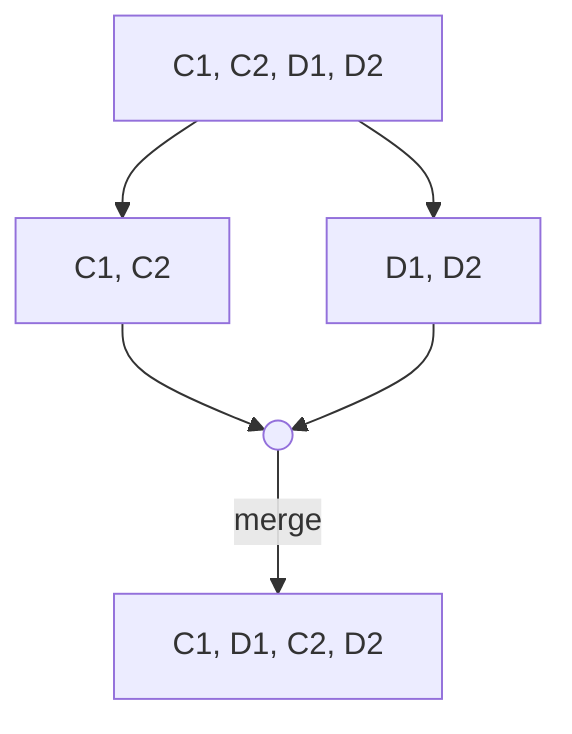
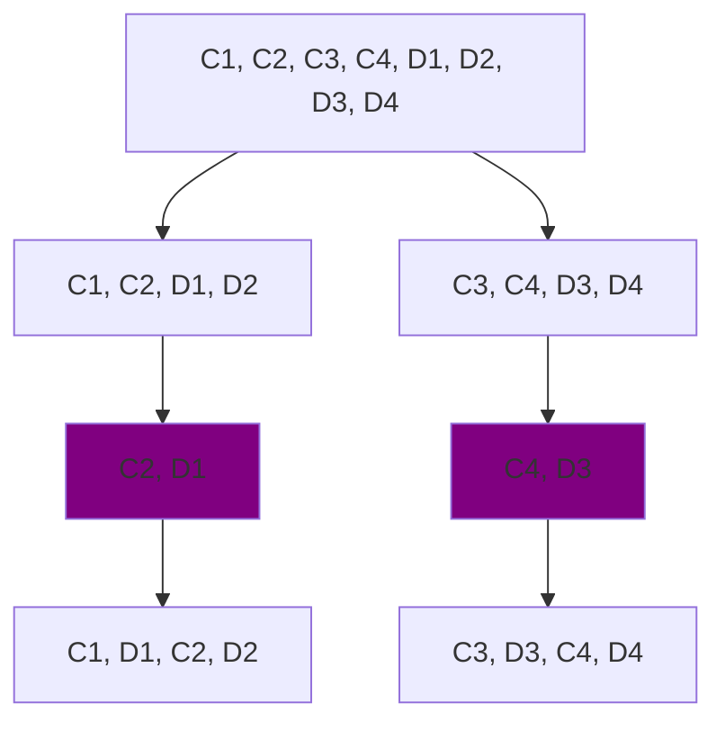
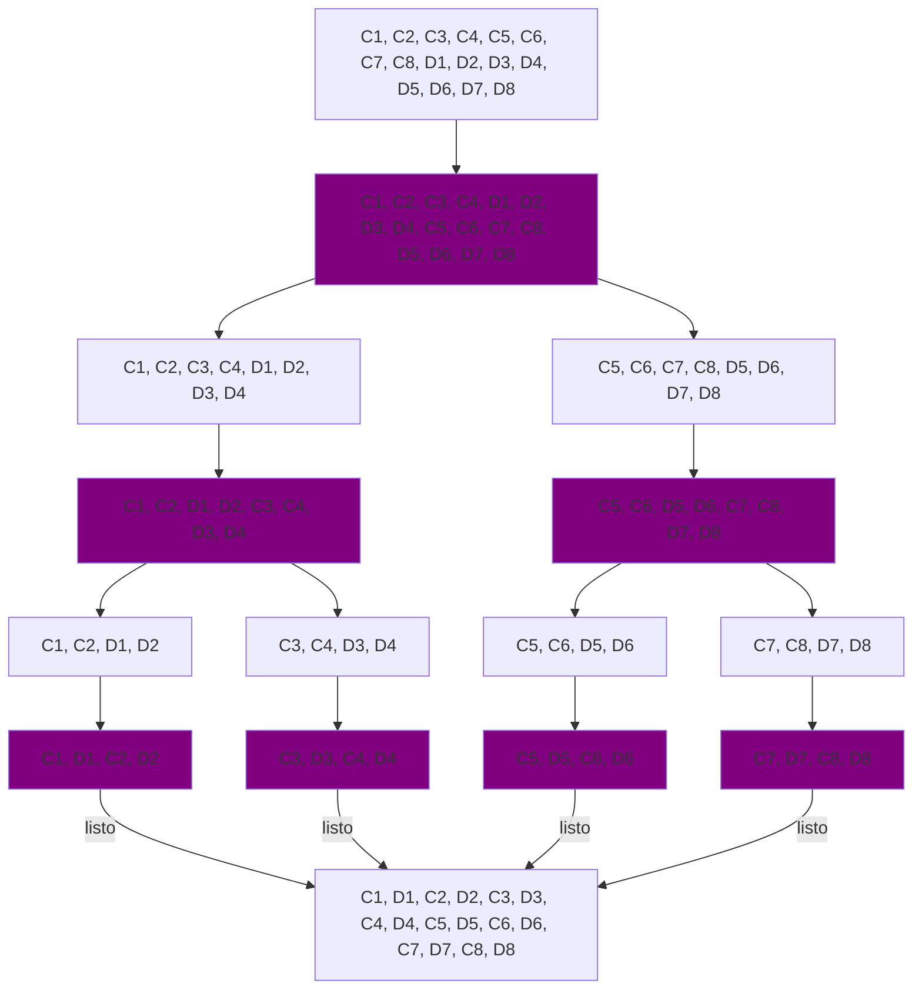
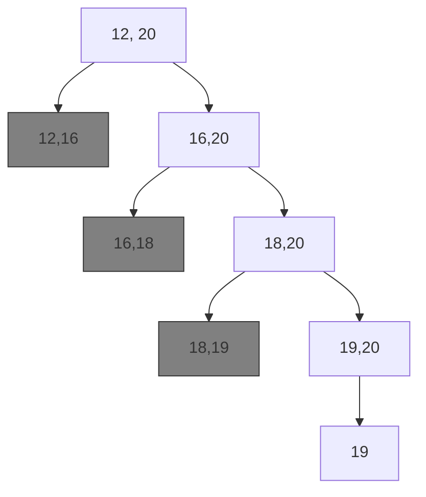

Implementar, por división y conquista, una función que dado un arreglo sin elementos repetidos y _casi ordenado_ (todos
los elementos se encuentran ordenados, salvo uno), obtenga el elemento fuera de lugar. Indicar y justificar su
complejidad temporal.

```
[1, 3, 5, 7, 9, 12, 29, 39, 45, 67, 68, 89, 90, 92, 96]
[1, 3, 5, 7, 9, 12, 29, 18, 39]
[1, 3, 5, 7, 9]
[1, 3, 5]
```

## RPL: Alternar

Tenemos un arreglo de tamaño `2n` de la forma `{C1, C2, C3, … Cn, D1, D2, D3, … Dn}`, tal que la cantidad total de
elementos
del arreglo es potencia de 2 (por ende, `n` también lo es). Implementar un algoritmo de División y Conquista que
modifique
el arreglo de tal forma que quede con la forma `{C1, D1, C2, D2, C3, D3, …, Cn, Dn}`, sin utilizar espacio adicional (
obviando el utilizado por la recursividad y variables de tipos simples). ¿Cual es la complejidad del algoritmo?

Pista: Pensar primero cómo habría que hacer si el arreglo tuviera 4 elementos (`{C1, C2, D1, D2}`). Luego, pensar a
partir
de allí el caso de 8 elementos, etc… para encontrar el patrón.





El algoritmo general se ve asi, pero lo que hace es intercambiar mitades de los arreglos. En este ejemplo, el arreglo
tiene $4^2$ elementos. Con lo cual, intercambia los 4 elementos a la izquierda de la mitad, con los 4 elementos a la
derecha de la mitad.

Pasos:

0. Si el largo del arreglo es 2 o menos, no hacer nada.
1. Ordena la parte del centro del arreglo.
2. Divide en 2 partes el problema.
3. Vuelve al paso 0 para cada mitad



```python
def alternar_aux(arr, i, j):
    if j - i <= 2:
        return
    m = (i + j) // 2

    lenght = (j - i) // 4
    for k in range(i + lenght, m, 1):
        arr[k], arr[k + lenght] = arr[k + lenght], arr[k]

    alternar_aux(arr, i, m)
    alternar_aux(arr, m, j)

"""
Pasos:
0. Si el largo del arreglo es 2 o menos, no hacer nada.
1. Ordena la parte del centro del arreglo.
2. Divide en 2 partes el problema.
3. Vuelve al paso 0 para cada mitad

T(n) = 2T(n/2) + O(n/2) -> O(n log n)
"""

def alternar(arr):
    alternar_aux(arr, 0, len(arr))

```

## Raices

Se sabe, por el teorema de Bolzano, que si una función es continua en un intervalo $[a, b]$, y que en el punto $a$ es
positiva y en el punto $b$ es negativa (o viceversa), necesariamente debe haber (al menos) una raíz en dicho intervalo.
Implementar una función raiz que reciba una función $f$ (univariable) y los extremos mencionados $a$ y $b$, y devuelva
una raíz
dentro de dicho intervalo (si hay más de una, simplemente quedarse con una). La complejidad de dicha función debe ser
logarítmica del largo del intervalo $[a, b]$.

Asumir que por más que se esté trabajando con números enteros, hay raíz en
dichos valores: Se puede trabajar con floats, y el algoritmo será equivalente, simplemente se plantea con ints para no
generar confusiones con la complejidad. Justificar la complejidad de la función implementada.

##### Ejemplo:

Si el intervalo es $[12,20]$ y la raiz esta en $c = 19$



```python
def f(x):
    return x


def raiz_aux(f, a, b):
    if b - a == 1:
        return a
    m = (a + b) // 2
    if f(m) * f(a) > 0:  # si f(a) y f(m) comparten signo  
        return raiz_aux(f, m, b)
    else:
        return raiz_aux(f, a, m)


def raiz(f, a, b):
    if f(a) == 0:
        return a
    if f(b) == 0:
        return b
    if f(a) * f(b) > 0:
        raise ValueError("No hay raiz en el intervalo")
    return raiz_aux(f, a, b)
``` 

## Balanza y Joyas

Es el año 1700, y la pirata Barba-ra Verde atacó un barco de la Royal British Shipping & Something, que transportaba una
importante piedra preciosa de la corona británica. Al parecer, la escondieron en un cofre con muchas piedras preciosas
falsas, en caso de un ataque. Barba-ra Verde sabe que los refuerzos británicos no tardarán en llegar, y deben huir lo
más rápido posible. El problema es que no pueden llevarse el cofre completo por pesar demasiado. Necesita encontrar
rápidamente la joya verdadera. La única forma de descubrir la joya verdadera es pesando. Se sabe que la joya verdadera
va a pesar más que las imitaciones, y que las imitaciones pesan todas lo mismo. Cuenta con una balanza de platillos para
poder pesarlas (es el 1700, no esperen una balanza digital).

Indicar la posición de la Joya verdadera.

En el ejemplo de código inicial de la actividad mostramos un llamado de ejemplo a la función balanza, a la que se le
deben pasar los dos conjuntos de joyas a verificar. La cantidad de joyas en cada conjunto debe ser la misma, para que el
resultado de la balanza de platillos nos dé información.
* Si los dos platillos pesan lo mismo, `balanza` devuelve 0.
* Si el primer platillo es más pesado, `balanza` devuelve 1.
* Si el segundo platillo es más pesado, `balanza` devuelve -1.

```python
def balanza(a,b):
    pass

def es_impar(x):
    return x % 2 == 0

def encontrar_aux(joyas, ini, fin):
    mid = (ini + fin) // 2
    cantidad = fin - ini

    if cantidad <= 1:
        return mid


    if es_impar(cantidad):
        if balanza(joyas[ini:mid], joyas[mid+1:fin]) == 0:
            return mid
        else:
            mid += 1

    res = balanza(joyas[ini:mid], joyas[mid:fin])

    if res == 1:
        return encontrar_aux(joyas, ini, mid)
    elif res == -1:
        return encontrar_aux(joyas, mid, fin)

def encontrar_joya(joyas):
    # Ejemplo de uso de balanza: balanza(joyas[:2], joyas[2:4])
    return encontrar_aux(joyas, 0, len(joyas))

    
```

