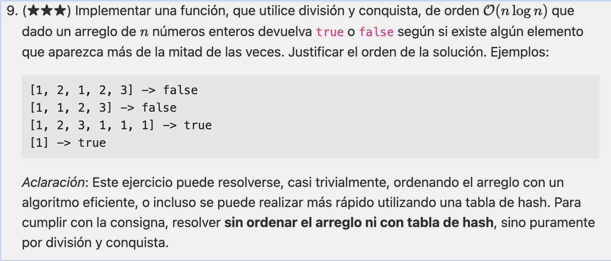
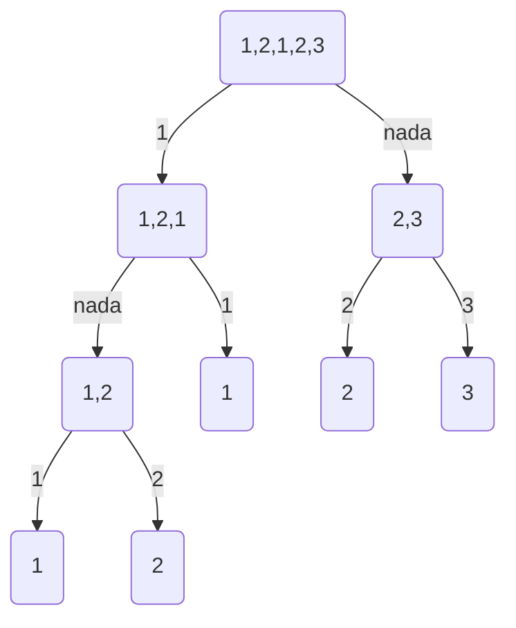
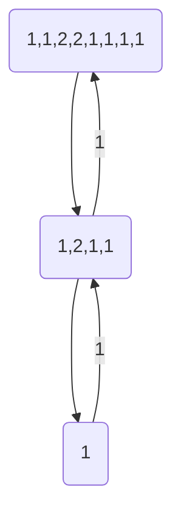
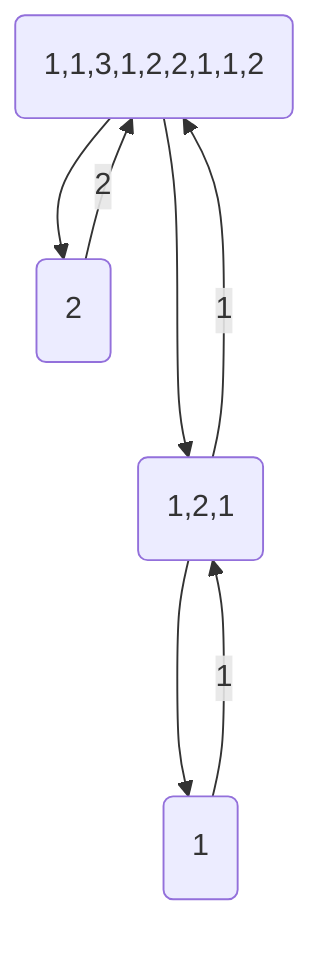

```python
def _mas_mitad(arr, ini, fin):
    if fin - ini < 1:
        return arr[ini]
    medio = (ini + fin) // 2
    e1 = _mas_mitad(arr, ini, medio)
    e2 = _mas_mitad(arr, medio, fin)

    count1, count2 = 0, 0
    for i in range(ini, fin + 1):
        if e1 == arr[i]:
            count1 += 1
        if e2 == arr[i]:
            count2 += 1
    if count1 > medio + 1:
        return e1
    if count2 > medio + 1:
        return e2
    return None


def mas_mitad(arr):
    return _mas_mitad(arr, 0, len(arr) - 1)
```

Complejidad: T(n) = nlogn

## complejidad O(n)

construyo un nuevo arreglo que no es ni la mitad izq ni la mitad derecha.
Para que un elemento aparezca mas la mitad de las veces, tiene que estar al lado de si mismo.

En algun lugar del arreglo, debe aparecer mas de la mitad de las veces.
Armar en cada paso un sub-arreglo que tenga elementos que pertenezcan al arreglo original. Con la regla de que en el
nuevo
sub-arreglo van a estar elementos que aparezcan juntos en el arreglo original:

Si es par



Si es impar



La misma idea luego, haces el count con los cantidatos.

```python
def mas_de_la_mitad_rec(arr):
    if len(arr) == 1:
        return arr[0]
    if len(arr) == 0:
        return None

    l = []
    for i in range(0, len(arr) - 1, 2):
        if arr[i] == arr[i + 1]:
            l.append(arr[i])
    candidato = mas_de_la_mitad_rec(l)
    if candidato is not None and arr.count(candidato) > len(arr) // 2:
        return candidato
    if len(arr) % 2 != 0 and arr.count(arr[-1]) > len(arr) // 2:
        return candidato
    return None


def mas_de_la_mitad(arr):
    candidato = mas_de_la_mitad_rec(arr)
    return None if candidato is None or arr.count(candidato) <= len(arr) // 2 else candidato
```

