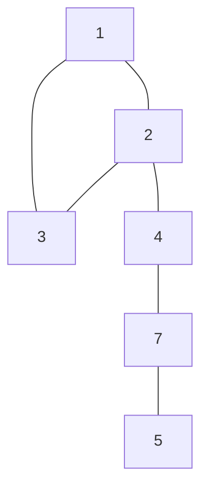
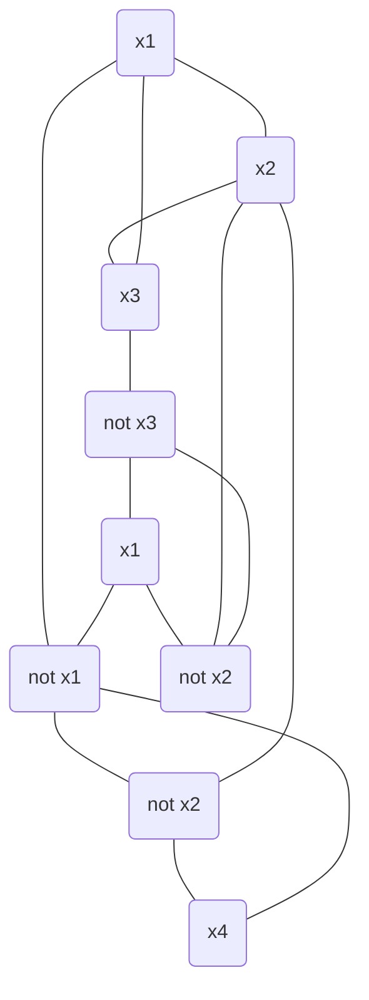

Una instancia del problema Y puede ser resuelta por una cantdad de pasos poliomicos y una cantidad de llamados
polinomicos si es que Y es reducible polinomialmente a X.

$$
Y \leq_p X
$$

$Y$ es a lo sumo tan grande como $X$ $\Rightarrow$ $X$ es al menos tan dificil como $Y$.

Como $X$ es al menos tan dificil como $Y$, si $X$ se puede resolver en tiempo polinomial, entonces Y **también**.

### Ejemplo banana: Ordenar vs Encontrar el Max

Si no sabemos encontrar el maximo, ese problema se reduce a ordenar y ver una **pos**. Incluso sin saber como ordenar,
podemos decir que:

* Ordenar es _al menos_ tan dificil como encontrar el maximo en un arreglo.
* Encontrar el maximo es _a lo sumo_ tan dificil como ordenar un arreglo.
* Sabemos que hay un algoritmo **polinomial** para ordenar $\Rightarrow$ encontrar el maximo tambien se puede resolver
  en tiempo polinomial.

### Ejemplo busquedas:

Si se como "Buscar un elemento en un arreglo ordenado" y me piden "Buscar un elemento en un arreglo (desordenado)",
puedo reducir el problema de "buscar en desordenado" a "buscar desordenado" polinomialmente. Es decir, ordenar el
arreglo y aplicar la solucion de "buscar un elemento en un arreglo ordenado".

### Problemas de decision

A partir de ahora vamos a plantear los problemas de una forma booleana. Por ejemplo: "¿Existe un camino entre A y B?". "

* Existe un set de (al menos) tamanio k para un independet set?".

### Independent Set vs Vertex Cover

Independent Set: Subconjunto en el cual ningun vertice de ese conjunto sea adyacente a otro
Vertex Cover: Subconjunto en el cual juntando los vertices del subconjunto, sus ejes son todos los ejes del grafo.

+ Puedo reducir Independent Set a Vertex Conver?

**TEOREMA**
$S$ es un set independiente de $G$ sii $V - S$ es vertex cover de $G$.

Demostracion: Si tengo un Inpendent Set $S$, si agarro cualquier arista (v, w) necesariamente al menos uno de ellos
tiene que estar en V-S porque no pueden estar ambos en S (por ser Independen Set) $\Rightarrow$ pasa por todas las
aristas $\Rightarrow$ $V-S$ es un vertex cover.

Supponemos un Vertx Cover $V-S$. Si agarramos un par de vertices en $S$. Supongamos que estan unidos por una arista,
pero entonces habria una arista no cubierta por $V-S$. Entonces es un absurdo y $S$ es un Independent Set.

Reducimos: $IS \leq_p VC$ si tenemos una caja negra que resuelve si un grafo tiene un VC de tamanio k. Para ver si tiene
un IS de tamanio X, le consultamos si tiene un VC de tamanio $|V| - X$. Si la respuesta es si, entonces el IS es de
tamanio X.

Haciendo al reves: $VC \leq_p IS$.

Por lo que $IS \leq_p VC$ y $VC \leq_p IS$ $\Rightarrow$ $IS, VC$ son igual de _dificiles_.

### SAT / 3SAT

**SAT** es un conjunto de clausulas.

$(x_1 \vee x_2 \vee \overline{x_3} \vee x_4) \wedge (x_3 \vee \overline{x_4}) \wedge (\overline{x_2} \vee \overline{x_1})$

"Existe un conjunto de valores de verdad que hacen que todas las clausulas sean verdaderas?".

**3SAT**: Cada clausula tiene 3 literales.

$(x_1 \vee x_2 \vee x_3) \wedge (\overline{x_1} \vee x_2 \vee x_3) \wedge (\overline{x_1} \vee x_2 \vee x_3)$

"Existe un conjunto de valores de verdad que hacen que todas las clausulas sean verdaderas?".

$3SAT \leq_p SAT$. -> tirvial

$SAT \leq_p 3SAT$. -> no tan trivial

**TEOREMA**: $3SAT$ es equivalente a $SAT$.

### 3SAT vs Independent Set

1. Ponemos nodos = terminos ($3k$ nodos) de cada clausula.
2. Creamos triangulos por cada clausula
3. Ponemos aristas en prosibles conflictos (variables opuestas)
4. Se puede demostrar que G tiene un set independiente de tamanio $k$ sii el 3SAT es satisfacible.

Si hay 3Sat, hay IS:

* Si es satisfacible, al menos 1 nodo de cada triangulo es True/1. Agarramos un vertice de cada triangulo tal que valga
  True/1. -> Ese set es independiente. (no puede generar conflictos)

Si hay Independent Set, hay 3SAT:

* Por cada x_i, si esta en el set, va 1. Si esta el complemento va el 0. Si no hay ninguno, ponemos alguno en 0 y otro
  en 1. Como hay un IS de tamanio k -> necesariamente hay al menos un 1 por cada triangulo. -> se cumple 3SAT.

## Problemas vs Algoritmos vs Chequeos

Dado un problema y una solucion, deberiamos poder tambien tener un **validador**.

P: problemas que se pueden resolver en tiempo polinomial.

NP: problemas que se pueden chequear en tiempo polinomial con un **certificador eficiente**. Es decir, que se puedan
validar en tiempo polinomial.

### Ejemplos

* Problema de Scheduling: existe un conjunto k de charlas que no se superponen?
* Puntos mas cercanos: Dados n puntos, hay dos que esten a distancia menor a d?
* Flujo en una red: existe una asignacion de flujo que cumpla con las condiciones de Flujo tal que $F_max \geq k$?
* Hamiltoniano: Dado un grafo, existe un ciclo que pase por todos los nodos?
* Problema de la mochila: existe un conjunto de elementos tales que su peso sea menor a W y su valor sea al menos V?
* Contraseña: Dada una contraseña, es correcta?

### P \subseteq NP

Pues cualquier problema que puede resolverse en tiempo Polinomial tambien se puede validar en tiempo Polinomial.

### NP \subseteq P?

No se sabe.

### NP-Completo

Un problema que esta en NP y todos los problemas en NP se pueden reducir a este.

Suponiendo que existe un problema NP-completo, todos los problemas NP (y P obviamente) se pueden reducir a este
problema. Por lo que si podemos resolver un problema NP-completo en tiempo polinomial, entonces todos los problemas NP
se pueden resolver en tiempo polinomial.

## Conclusiones
1. Podemos comparar la dificultad de problemas transformando, reduciendo unos a otros.
2. Reducir Y a X implica que X es al menos tan complicado como Y. No dice cuán complicado es Y (aunque dice que es a lo sumo tan complicado como X).
3. Hay problemas fáciles, difíciles y los más difíciles.
4. Vimos clases de complejidad (un inicio) → Problemas NP-Completos → cualquier cosa a la que los podamos reducir son NP-Completos.
5. Vamos a seguir laburando con esto, que no es fácil.  
