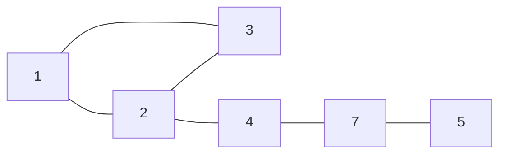
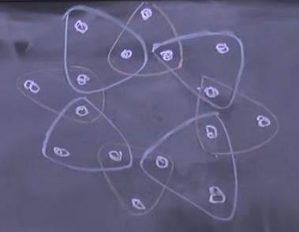
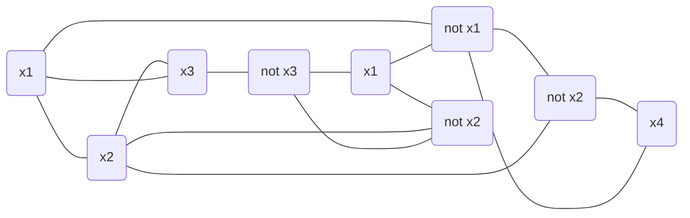
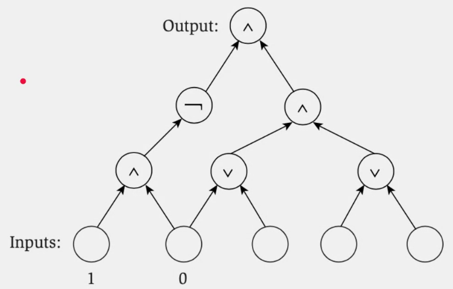
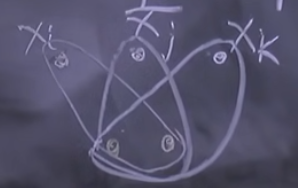
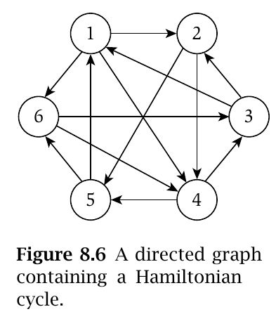
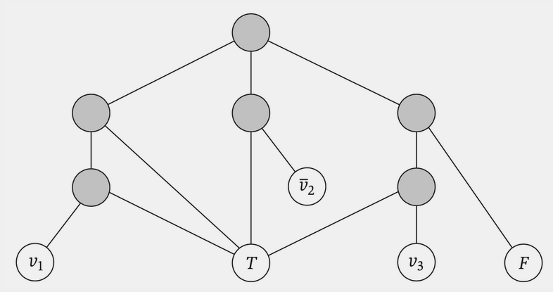

Una instancia del problema Y puede ser resuelta por una cantdad de pasos poliomicos y una cantidad de llamados
polinomicos si es que Y es reducible polinomialmente a X.

$$
Y \leq_p X
$$

$Y$ es a lo sumo tan grande como $X$ $\Rightarrow$ $X$ es al menos tan dificil como $Y$.

Como $X$ es al menos tan dificil como $Y$, si $X$ se puede resolver en tiempo polinomial, entonces Y **también**.

### Ejemplo banana: Ordenar vs Encontrar el Max

Si no sabemos encontrar el maximo, ese problema se reduce a ordenar y ver una **pos**. Incluso sin saber como ordenar,
podemos decir que:

* Ordenar es _al menos_ tan dificil como encontrar el maximo en un arreglo.
* Encontrar el maximo es _a lo sumo_ tan dificil como ordenar un arreglo.
* Sabemos que hay un algoritmo **polinomial** para ordenar $\Rightarrow$ encontrar el maximo tambien se puede resolver
  en tiempo polinomial.

### Ejemplo busquedas:

Si se como "Buscar un elemento en un arreglo ordenado" y me piden "Buscar un elemento en un arreglo (desordenado)",
puedo reducir el problema de "buscar en desordenado" a "buscar desordenado" polinomialmente. Es decir, ordenar el
arreglo y aplicar la solucion de "buscar un elemento en un arreglo ordenado".

### Problemas de decision

A partir de ahora vamos a plantear los problemas de una forma booleana. Por ejemplo: "¿Existe un camino entre A y B?". "

* Existe un set de (al menos) tamanio k para un independet set?".

### Independent Set vs Vertex Cover

Independent Set: Subconjunto en el cual ningun vertice de ese conjunto sea adyacente a otro
Vertex Cover: Subconjunto en el cual juntando los vertices del subconjunto, sus ejes son todos los ejes del grafo.

+ Puedo reducir Independent Set a Vertex Conver?

**TEOREMA**
$S$ es un set independiente de $G$ sii $V - S$ es vertex cover de $G$.

Demostracion: Si tengo un Inpendent Set $S$, si agarro cualquier arista (v, w) necesariamente al menos uno de ellos
tiene que estar en V-S porque no pueden estar ambos en S (por ser Independen Set) $\Rightarrow$ pasa por todas las
aristas $\Rightarrow$ $V-S$ es un vertex cover.

Supponemos un Vertx Cover $V-S$. Si agarramos un par de vertices en $S$. Supongamos que estan unidos por una arista,
pero entonces habria una arista no cubierta por $V-S$. Entonces es un absurdo y $S$ es un Independent Set.

Reducimos: $IS \leq_p VC$ si tenemos una caja negra que resuelve si un grafo tiene un VC de tamanio k. Para ver si tiene
un IS de tamanio X, le consultamos si tiene un VC de tamanio $|V| - X$. Si la respuesta es si, entonces el IS es de
tamanio X.

Haciendo al reves: $VC \leq_p IS$.

Por lo que $IS \leq_p VC$ y $VC \leq_p IS$ $\Rightarrow$ $IS, VC$ son igual de _dificiles_.

### SAT / 3SAT

**SAT** es un conjunto de clausulas.

$(x_1 \vee x_2 \vee \overline{x_3} \vee x_4) \wedge (x_3 \vee \overline{x_4}) \wedge (\overline{x_2} \vee \overline{x_1})$

"Existe un conjunto de valores de verdad que hacen que todas las clausulas sean verdaderas?".

**3SAT**: Cada clausula tiene 3 literales.

$(x_1 \vee x_2 \vee x_3) \wedge (\overline{x_1} \vee x_2 \vee x_3) \wedge (\overline{x_1} \vee x_2 \vee x_3)$

"Existe un conjunto de valores de verdad que hacen que todas las clausulas sean verdaderas?".

$3SAT \leq_p SAT$. -> tirvial

$SAT \leq_p 3SAT$. -> no tan trivial

**TEOREMA**: $3SAT$ es equivalente a $SAT$.

### 3SAT vs Independent Set

1. Ponemos nodos = terminos ($3k$ nodos) de cada clausula.
2. Creamos triangulos por cada clausula
3. Ponemos aristas en prosibles conflictos (variables opuestas)
4. Se puede demostrar que G tiene un set independiente de tamanio $k$ sii el 3SAT es satisfacible.

Si hay 3Sat, hay IS:

* Si es satisfacible, al menos 1 nodo de cada triangulo es True/1. Agarramos un vertice de cada triangulo tal que valga
  True/1. -> Ese set es independiente. (no puede generar conflictos)

Si hay Independent Set, hay 3SAT:

* Por cada x_i, si esta en el set, va 1. Si esta el complemento va el 0. Si no hay ninguno, ponemos alguno en 0 y otro
  en 1. Como hay un IS de tamanio k -> necesariamente hay al menos un 1 por cada triangulo. -> se cumple 3SAT.

## Problemas vs Algoritmos vs Chequeos

Dado un problema y una solucion, deberiamos poder tambien tener un **validador**.

P: problemas que se pueden resolver en tiempo polinomial.

NP: problemas que se pueden chequear en tiempo polinomial con un **certificador eficiente**. Es decir, que se puedan
validar en tiempo polinomial.

### Ejemplos

* Problema de Scheduling: existe un conjunto k de charlas que no se superponen?
* Puntos mas cercanos: Dados n puntos, hay dos que esten a distancia menor a d?
* Flujo en una red: existe una asignacion de flujo que cumpla con las condiciones de Flujo tal que $F_max \geq k$?
* Hamiltoniano: Dado un grafo, existe un ciclo que pase por todos los nodos?
* Problema de la mochila: existe un conjunto de elementos tales que su peso sea menor a W y su valor sea al menos V?
* Contraseña: Dada una contraseña, es correcta?

### $P \subseteq NP$

Pues cualquier problema que puede resolverse en tiempo Polinomial tambien se puede validar en tiempo Polinomial.

### $NP \subseteq P$?

No se sabe.

### NP-Completo

Un problema que esta en NP y todos los problemas en NP se pueden reducir a este.

Suponiendo que existe un problema NP-completo, todos los problemas NP (y P obviamente) se pueden reducir a este
problema. Por lo que si podemos resolver un problema NP-completo en tiempo polinomial, entonces todos los problemas NP
se pueden resolver en tiempo polinomial.

## Conclusiones

1. Podemos comparar la dificultad de problemas transformando, reduciendo unos a otros.
2. Reducir Y a X implica que X es al menos tan complicado como Y. No dice cuán complicado es Y (aunque dice que es a lo
   sumo tan complicado como X).
3. Hay problemas fáciles, difíciles y los más difíciles.
4. Vimos clases de complejidad (un inicio) → Problemas NP-Completos → cualquier cosa a la que los podamos reducir son
   NP-Completos.
5. Vamos a seguir laburando con esto, que no es fácil.

# Clase 2

$X \in NP-completo$ sii:

* $X \in NP$
* Para todo $Y \in NP$, $Y \leq_p X$

La reduccion $Y_{completo} \leq_p X$ implica que $X_{completo}$ es al menos tan dificil como $Y_{completo}$.
Consecuentcias:

1. Si $X$ es un problema NP-Completo, solo puede reseolverse en tiempo polinomial sii $P = NP$.

## NP-Completo

Teorema de Cook & Levin: Circuit SAT es NP-Completo.

Circuit SAT: Dado un circuito, existe una asignacion de valores de verdad que haga que el circuito sea verdadero?

Siempre decimos que $Y \leq_p X$ si es que al problema $Y$ puedo reducirlo a $X$ y resolver $X$ con una caja negra que
lo resuelve en tiempo polinomial y podemos usarla una cantidad polinomial de veces.

Si logramos:

1. $X \in NP$
2. $CS \leq_p X$

Entonces $X$ es NP-Completo.

Para ver si $CS$ es un problema NP debo encontrar un certificador eficiente (en tiempo polinomial) que reciba el
problema que tenemos y una posible solucion para revisar si es correcta.

Si logramos reducir un problema NP-Completo a otro X -> X es NP-Completo por **propiedad de transitividad**

Se puede reducir $CS$ a $3-SAT$.
... ver demostracion en clase ...

### N-Reinas

Es un problema $NP$ pues se puede hacer un verificador eficiente de la solucion.

Lo habiamos reducido a $IS$. por lo que $N-Reinas \leq_p IS$. Sabemos que $IS$ es NP-Completo.
Opciones:

* Nos falta ver si $IS \leq_p N-Reinas$. Si esto se cumple, entonces $N-Reinas$ es NP-Completo.
* Tambien podria agarrar cualquier problema NP-Completo y reducirlo a $N-Reinas$.

### Ejercitacion:

#### 1. Ver si un numero es multiplo de otro a ver si un elemento esta un una lista

* Es A multiplo de B?
* Para esto deberiamos tener una lista con los multiplos de B desde 0 hasta A. Si A esta en la lista, es multiplo.

#### 2. Ver si K-clique es NP-Completo usando Independent Set

A clique, C, in an undirected graph G = (V, E) is a subset of the vertices, C ⊆ V, such that every two distinct vertices
are adjacent.

Sabemos que es NP pues podemos verificarlo con un certificador eficiente: hay que ver que todos los vertices del
subgrafo tengan igual grado a la cantidad de vertices del subgrafo.
Nos falta reducir IS a K-clique.

IS: existe un conjunto de vertices de tamaño k tal que no haya aristas entre ellos.

Para el grafo original G $/\forall v \in IS$ por lo que $G^c$ (complemento de G) tiene un clique de tamaño k.

1. Obtenemos el grafo complemento de G. -> **Aristas** que no estan en G.
2. Definimos que hay un IS de al menos K vertices sii hay un clique de tamaño K en el grafo complemento.

Si en el grafo G $ \exists IS \geq k \Leftarrow\Rightarrow \exists K-C \geq k$ para el grafo complementario $G^c$.

Debo demostrar la idea.

$\Rightarrow$ Si hay un IS de tamaño k en G, entonces hay un clique de tamaño k en $G^c$.
Hipotesis: Si tengo un IS de tamaño k en G, entonces no hay aristas entre ellos. Por lo que en $G^c$ hay aristas entre
todos ellos entre si. Por lo que hay un clique de tamaño k en $G^c$.

$\Leftarrow$ Si hay un clique de tamaño k en $G^c$, entonces hay un IS de tamaño k en G.
Hipotesis: Si tengo un clique de tamaño k en $G^c$, entonces hay aristas entre todos ellos. Por lo que en G no hay
aristas entre ellos. Por lo que hay un IS de tamaño k en G.

La tecnica fue asumiendo la hipotesis, demuestro la otra parte de forma directa.

Por lo que $IS \leq_p K-C$. pues si tengo una caja negra que resuelve K-C, puedo resolver IS. Primero debo darle a la
caja negra que resuelve K-C el grafo complemento y obtengo la respuesta a la pregunta original.

Por lo que $K-C$ es NP-Completo.

### Estrategias para reducir en general

1. Reduccion por equivalencia simple (Independent Set, K-clique, Vertex Cover)
2. Reduccion de caso general a caso general (Nreinas a Independet Set)
3. Reduccion por encodeo de caracteristicas

### Veamos Programacion Lineal

Programacion Lineal es un problema:

+ Es la ganancia $\leq k$?
+ Es la ganancia $\geq k$?

Es NP pues puedo chequear si la solucion es correcta en tiempo polinomial.

1. Me fijo si cumple con las restricciones
2. Me fijo si la $opt == ganancia$ es la esperada.

$PL \in NP$,
$PLE \in NP-Completo$

## Coloreo de Grafos
Cuando k = 2 $\rightarrow$ es bipartito.
Cuando k = 3 $\rightarrow$ NP-completo.

1. Esta en NP: si
2. 3-SAT $\leq_p$ Coloreo de Grafos: veremo

1. Crear un nodo por cada variable $x_i$ y un nodo por su complemento $\overline{x_i}$.
2. Unir los vertices de variables con sus complementos. -> con esto aseguramos que no haya contradicciones entre una variable y su complemento. Ya que si estan unidos, no pueden tener el mismo color (es decir, no pueden tener el mismo valor de verdad). 
3. Creamos 3 nodos especiales: True, False, Base.
4. Unimos a cada varaible y complemento con Base para formar triangulos
5. Unimos True con todas las variables y False con todos los complementos.

## Subset Sum
Recordamos: dado un conjunto de n elementos y un peso W, existe un subconjunto que sume exactamente W?

Por progamacion dinamica: O(nW) $\rightarrow$ es pesudopolinomial.

Susbset Sum es NP-completo