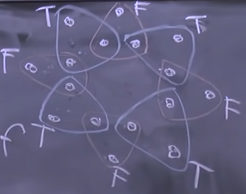
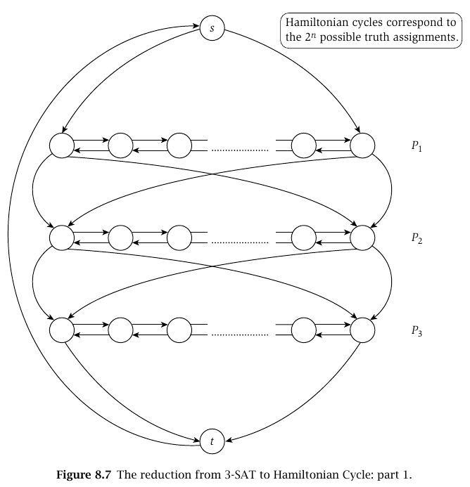

Una instancia del problema Y puede ser resuelta por una cantdad de pasos poliomicos y una cantidad de llamados
polinomicos si es que Y es reducible polinomialmente a X.

$$
Y \leq_p X
$$

$Y$ es a lo sumo tan grande como $X$ $\Rightarrow$ $X$ es al menos tan dificil como $Y$.

Como $X$ es al menos tan dificil como $Y$, si $X$ se puede resolver en tiempo polinomial, entonces Y **también**.

### Ejemplo banana: Ordenar vs Encontrar el Max

Si no sabemos encontrar el maximo, ese problema se reduce a ordenar y ver una **pos**. Incluso sin saber como ordenar,
podemos decir que:

* Ordenar es _al menos_ tan dificil como encontrar el maximo en un arreglo.
* Encontrar el maximo es _a lo sumo_ tan dificil como ordenar un arreglo.
* Sabemos que hay un algoritmo **polinomial** para ordenar $\Rightarrow$ encontrar el maximo tambien se puede resolver
  en tiempo polinomial.

### Ejemplo busquedas:

Si se como "Buscar un elemento en un arreglo ordenado" y me piden "Buscar un elemento en un arreglo (desordenado)",
puedo reducir el problema de "buscar en desordenado" a "buscar desordenado" polinomialmente. Es decir, ordenar el
arreglo y aplicar la solucion de "buscar un elemento en un arreglo ordenado".

### Problemas de decision

A partir de ahora vamos a plantear los problemas de una forma booleana. Por ejemplo: "¿Existe un camino entre A y B?". "

* Existe un set de (al menos) tamanio k para un independet set?".

### Independent Set vs Vertex Cover

Independent Set: Subconjunto en el cual ningun vertice de ese conjunto sea adyacente a otro
Vertex Cover: Subconjunto en el cual juntando los vertices del subconjunto, sus ejes son todos los ejes del grafo.

+ Puedo reducir Independent Set a Vertex Conver?

**TEOREMA**
$S$ es un set independiente de $G$ sii $V - S$ es vertex cover de $G$.

Demostracion: Si tengo un Inpendent Set $S$, si agarro cualquier arista (v, w) necesariamente al menos uno de ellos
tiene que estar en V-S porque no pueden estar ambos en S (por ser Independen Set) $\Rightarrow$ pasa por todas las
aristas $\Rightarrow$ $V-S$ es un vertex cover.

Supponemos un Vertx Cover $V-S$. Si agarramos un par de vertices en $S$. Supongamos que estan unidos por una arista,
pero entonces habria una arista no cubierta por $V-S$. Entonces es un absurdo y $S$ es un Independent Set.

Reducimos: $IS \leq_p VC$ si tenemos una caja negra que resuelve si un grafo tiene un VC de tamanio k. Para ver si tiene
un IS de tamanio X, le consultamos si tiene un VC de tamanio $|V| - X$. Si la respuesta es si, entonces el IS es de
tamanio X.

Haciendo al reves: $VC \leq_p IS$.

Por lo que $IS \leq_p VC$ y $VC \leq_p IS$ $\Rightarrow$ $IS, VC$ son igual de _dificiles_.

### SAT / 3SAT

**SAT** es un conjunto de clausulas.

$(x_1 \vee x_2 \vee \overline{x_3} \vee x_4) \wedge (x_3 \vee \overline{x_4}) \wedge (\overline{x_2} \vee \overline{x_1})$

"Existe un conjunto de valores de verdad que hacen que todas las clausulas sean verdaderas?".

**3SAT**: Cada clausula tiene 3 literales.

$(x_1 \vee x_2 \vee x_3) \wedge (\overline{x_1} \vee x_2 \vee x_3) \wedge (\overline{x_1} \vee x_2 \vee x_3)$

"Existe un conjunto de valores de verdad que hacen que todas las clausulas sean verdaderas?".

$3SAT \leq_p SAT$. -> tirvial

$SAT \leq_p 3SAT$. -> no tan trivial

**TEOREMA**: $3SAT$ es equivalente a $SAT$.

### 3SAT vs Independent Set

1. Ponemos nodos = terminos ($3k$ nodos) de cada clausula.
2. Creamos triangulos por cada clausula
3. Ponemos aristas en prosibles conflictos (variables opuestas)
4. Se puede demostrar que G tiene un set independiente de tamanio $k$ sii el 3SAT es satisfacible.

Si hay 3Sat, hay IS:

* Si es satisfacible, al menos 1 nodo de cada triangulo es True/1. Agarramos un vertice de cada triangulo tal que valga
  True/1. -> Ese set es independiente. (no puede generar conflictos)

Si hay Independent Set, hay 3SAT:

* Por cada x_i, si esta en el set, va 1. Si esta el complemento va el 0. Si no hay ninguno, ponemos alguno en 0 y otro
  en 1. Como hay un IS de tamanio k -> necesariamente hay al menos un 1 por cada triangulo. -> se cumple 3SAT.

## Problemas vs Algoritmos vs Chequeos

Dado un problema y una solucion, deberiamos poder tambien tener un **validador**.

P: problemas que se pueden resolver en tiempo polinomial.

NP: problemas que se pueden chequear en tiempo polinomial con un **certificador eficiente**. Es decir, que se puedan
validar en tiempo polinomial.

### Ejemplos

* Problema de Scheduling: existe un conjunto k de charlas que no se superponen?
* Puntos mas cercanos: Dados n puntos, hay dos que esten a distancia menor a d?
* Flujo en una red: existe una asignacion de flujo que cumpla con las condiciones de Flujo tal que $F_max \geq k$?
* Hamiltoniano: Dado un grafo, existe un ciclo que pase por todos los nodos?
* Problema de la mochila: existe un conjunto de elementos tales que su peso sea menor a W y su valor sea al menos V?
* Contraseña: Dada una contraseña, es correcta?

### $P \subseteq NP$

Pues cualquier problema que puede resolverse en tiempo Polinomial tambien se puede validar en tiempo Polinomial.

### $NP \subseteq P$?

No se sabe.

### NP-Completo

Un problema que esta en NP y todos los problemas en NP se pueden reducir a este.

Suponiendo que existe un problema NP-completo, todos los problemas NP (y P obviamente) se pueden reducir a este
problema. Por lo que si podemos resolver un problema NP-completo en tiempo polinomial, entonces todos los problemas NP
se pueden resolver en tiempo polinomial.

## Conclusiones

1. Podemos comparar la dificultad de problemas transformando, reduciendo unos a otros.
2. Reducir Y a X implica que X es al menos tan complicado como Y. No dice cuán complicado es Y (aunque dice que es a lo
   sumo tan complicado como X).
3. Hay problemas fáciles, difíciles y los más difíciles.
4. Vimos clases de complejidad (un inicio) → Problemas NP-Completos → cualquier cosa a la que los podamos reducir son
   NP-Completos.
5. Vamos a seguir laburando con esto, que no es fácil.

# Clase 2

$X \in NP-completo$ sii:

* $X \in NP$
* Para todo $Y \in NP$, $Y \leq_p X$

La reduccion $Y_{completo} \leq_p X$ implica que $X_{completo}$ es al menos tan dificil como $Y_{completo}$.
Consecuentcias:

1. Si $X$ es un problema NP-Completo, solo puede reseolverse en tiempo polinomial sii $P = NP$.

## NP-Completo

Teorema de Cook & Levin: Circuit SAT es NP-Completo.

Circuit SAT: Dado un circuito, existe una asignacion de valores de verdad que haga que el circuito sea verdadero?

Siempre decimos que $Y \leq_p X$ si es que al problema $Y$ puedo reducirlo a $X$ y resolver $X$ con una caja negra que
lo resuelve en tiempo polinomial y podemos usarla una cantidad polinomial de veces.

Si logramos:

1. $X \in NP$
2. $CS \leq_p X$

Entonces $X$ es NP-Completo.

Para ver si $CS$ es un problema NP debo encontrar un certificador eficiente (en tiempo polinomial) que reciba el
problema que tenemos y una posible solucion para revisar si es correcta.

Si logramos reducir un problema NP-Completo a otro X -> X es NP-Completo por **propiedad de transitividad**

Se puede reducir $CS$ a $3-SAT$.
... ver demostracion en clase ...

### N-Reinas

Es un problema $NP$ pues se puede hacer un verificador eficiente de la solucion.

Lo habiamos reducido a $IS$. por lo que $N-Reinas \leq_p IS$. Sabemos que $IS$ es NP-Completo.
Opciones:

* Nos falta ver si $IS \leq_p N-Reinas$. Si esto se cumple, entonces $N-Reinas$ es NP-Completo.
* Tambien podria agarrar cualquier problema NP-Completo y reducirlo a $N-Reinas$.

### Ejercitacion:

#### 1. Ver si un numero es multiplo de otro a ver si un elemento esta un una lista

* Es A multiplo de B?
* Para esto deberiamos tener una lista con los multiplos de B desde 0 hasta A. Si A esta en la lista, es multiplo.

## 2. K-Clique vs Independent Set

A clique, C, in an undirected graph G = (V, E) is a subset of the vertices, C ⊆ V, such that every two distinct vertices
are adjacent.

Sabemos que es NP pues podemos verificarlo con un certificador eficiente: hay que ver que todos los vertices del
subgrafo tengan igual grado a la cantidad de vertices del subgrafo.
Nos falta reducir IS a K-clique.

IS: existe un conjunto de vertices de tamaño k tal que no haya aristas entre ellos.

Para el grafo original G $/\forall v \in IS$ por lo que $G^c$ (complemento de G) tiene un clique de tamaño k.

1. Obtenemos el grafo complemento de G. $\rightarrow$ **Aristas** que no estan en G.
2. Definimos que hay un IS de al menos K vertices sii hay un clique de tamaño K en el grafo complemento.

En el grafo $G$ $\exists \text{IS } \geq k \Leftarrow\Rightarrow \exists K-C \geq k$ para el grafo complementario $G^c$.

Grafo complemento:

Debo demostrar la idea.

$\Rightarrow$ Si hay un IS de tamaño k en G, entonces hay un clique de tamaño k en $G^c$.
Hipotesis: Si tengo un IS de tamaño k en G, entonces no hay aristas entre ellos. Por lo que en $G^c$ hay aristas entre
todos ellos entre si. Por lo que hay un clique de tamaño k en $G^c$.

$\Leftarrow$ Si hay un clique de tamaño k en $G^c$, entonces hay un IS de tamaño k en G.
Hipotesis: Si tengo un clique de tamaño k en $G^c$, entonces hay aristas entre todos ellos. Por lo que en G no hay
aristas entre ellos. Por lo que hay un IS de tamaño k en G.

La tecnica fue asumiendo la hipotesis, demuestro la otra parte de forma directa.

Por lo que $IS \leq_p K-C$. pues si tengo una caja negra que resuelve K-C, puedo resolver IS. Primero debo darle a la
caja negra que resuelve K-C el grafo complemento y obtengo la respuesta a la pregunta original.

Por lo que $K-C$ es NP-Completo.

### Estrategias para reducir en general

1. Reduccion por equivalencia simple (Independent Set, K-clique, Vertex Cover)
2. Reduccion de caso general a caso general (Nreinas a Independet Set)
3. Reduccion por encodeo de caracteristicas

### Veamos Programacion Lineal

Programacion Lineal es un problema:

+ Es la ganancia $\leq k$?
+ Es la ganancia $\geq k$?

Es NP pues puedo chequear si la solucion es correcta en tiempo polinomial.

1. Me fijo si cumple con las restricciones
2. Me fijo si la $opt == ganancia$ es la esperada.

$PL \in NP$,
$PLE \in NP-Completo$

## Coloreo de Grafos

Cuando k = 2 $\rightarrow$ es bipartito.
Cuando k = 3 $\rightarrow$ NP-completo.

1. Esta en NP: si
2. 3-SAT $\leq_p$ Coloreo de Grafos: veremo

1. Crear un nodo por cada variable $x_i$ y un nodo por su complemento $\overline{x_i}$.
2. Unir los vertices de variables con sus complementos. -> con esto aseguramos que no haya contradicciones entre una
   variable y su complemento. Ya que si estan unidos, no pueden tener el mismo color (es decir, no pueden tener el mismo
   valor de verdad).
3. Creamos 3 nodos especiales: True, False, Base.
4. Unimos a cada varaible y complemento con Base para formar triangulos
5. Unimos True con todas las variables y False con todos los complementos.

## Subset Sum

Recordamos: dado un conjunto de n elementos y un peso W, existe un subconjunto que sume exactamente W?

Por progamacion dinamica: O(nW) $\rightarrow$ es pesudopolinomial.

> _Susbset Sum es NP-completo_

## Vetex Cover vs Set Cover

| Grafo                       | Subsets                     |
|-----------------------------|-----------------------------|
|  |  |

## SAT and 3-SAT

Given a set $X$ of $n$ _Boolean variables_ $x_1, \dots x_n$; each can take the value 0 or 1. A set $C$ of _clauses_
over $X$, is a set of disjunctions of distinct terms. $$ t_1 \vee t_2 \vee \dots \vee t_k $$ where each
term $t_i \in \{x_1, x_2, \dots, x_n, \overline{x_1}, \dots, \overline{x_k} \}$.

A _truth assignment_ for $X$ is one of the value 0 or 1 to each $x_i$. That is, $v:X \rightarrow \{0,1\}$. The
assignment $v$ implicitly gives $v(\overline{x_i}) = 1 - v(x_i)$.

An assignment _satisfies_ a clause C if it casuses C to evaluate to 1 under boolean rules. That is,
if $C_1 \wedge C_2 \wedge \dots \wedge C_k$ is true.

## 3-SAT to Independent Set

here is how we encode it using independent sets in a graph. First, construct a
graph G = (V , E) consisting of 3k nodes grouped into k triangles as shown in
Figure.

That is, for $i = 1, 2, \dots , k$, we construct three vertices $v_{i1} , v_{i2} , v_{i3}$
joined to one another by **edges**. We give each of these vertices a label; $v_{ij}$ is
labeled with the $j^{\text{th}}$  term from the clause $C_i$ of the 3-SAT instance.

Since no two vertices cannot be selected from the same triangle, they consist of all ways of choosing one vertex from
each of the triangles. This is implementing our goal of choosing a term in each clause that will evaluate to 1; but we
have so far not prevented ourselves from choosing two terms that conflic.

We enconce conflicts by adding some more edges to the graph: For each pair of vertices whose labels correspond to terms
that conflict, we add an edge in between them. This ensures that no two vertices that conflict can be selected in the
same independent set.

Let’s claim, precisely, that the original 3-SAT instance is satisfiable if and
only if the graph G we have constructed has an independent set of size at least
k. First, if the 3-SAT instance is satisfiable, then each triangle in our graph
contains at least one node whose label evaluates to 1.

We claim S is independent; for if there
were an edge between two nodes u, v ∈ S, then the labels of u and v would
have to conflict; but this is not possible, since they both evaluate to 1.

# Clase 3

## Dominating Set vs Vertex Cover

Dominating Set: Dado un grafo, el DS es un subconjunto en el que todos los vertices o bien estan en el conjunto, o son
adyacentes a alguno de los vertices del conjunto

Dado un grafo y un numero k, existe un DS de tamaño k?

> Existe un DS de tamaño k sii existe un IS de tamaño |V|-k

#### DS es NP

El verificador recibe la solucion y chequea si es valida en tiempo polinomial. Hay que fijarse que todos los vertices
esten en el conjunto o sean adyacentes a alguno del conjunto.

#### Reduccion

Podemos usar Vertex Cover (VC). $DS \leq_p VC$.

* $VC \leq_p DS$
  Podemos armar un grafo G' a partir de G. Por cada vertice de G, creamos un vertice en G'.
  Por cada arista de G, creamos un vertice en G'. Por lo que si hay un VC de tamaño k en G, entonces hay un DS de tamaño
  k en G'.

Vamos a probar que Dominating Set (DS) es NP-completo. Para esto, necesitamos:

1. Probar que DS está en NP
2. Reducir Vertex Cover (VC) a DS (ya que sabemos que VC es NP-completo)

**1. DS está en NP:**

- Dado un certificado (un conjunto D de vértices)
- Podemos verificar en tiempo polinomial si D es un dominating set:
    * Para cada vértice v ∉ D, verificar si tiene un vecino en D
    * Esto toma O(|V| + |E|)

**2. Reducción de VC a DS:**
Vamos a construir una reducción que transforme una instancia de VC a una instancia de DS.

La reducción funciona así:

1. **Transformación del grafo G a G':**
    - Para cada arista e = (u,v) en G:
        * Añadir un nuevo vértice we en G'
        * Conectar we a u y v
    - Mantener todas las aristas originales

2. **Probar que G tiene un vertex cover de tamaño ≤ k si y solo si G' tiene un dominating set de tamaño ≤ k**

**→ (Si G tiene un VC de tamaño k, entonces G' tiene un DS de tamaño k):**

- Sea C un vertex cover de G de tamaño k
- Tomemos el mismo conjunto C en G'
- Para cada arista e en G:
    * Al menos un extremo está en C (por ser VC)
    * El nuevo vértice we está dominado por ese extremo
- Los vértices originales están conectados igual que en G
- Por lo tanto, C es un dominating set en G'

**← (Si G' tiene un DS de tamaño k, entonces G tiene un VC de tamaño ≤ k):**

- Sea D un dominating set de G' de tamaño k
- Si D contiene algún we, podemos reemplazarlo por uno de sus vecinos
- Este nuevo conjunto D' es:
    * Del mismo tamaño o menor que D
    * Solo contiene vértices originales
    * Sigue siendo un dominating set
- D' debe ser un vertex cover en G porque:
    * Cada we debe estar dominado
    * Esto solo es posible si al menos un extremo de su arista original está en D'

3. **La reducción es polinomial:**

- |V'| = |V| + |E|
- |E'| = |E| + 2|E| = 3|E|
- La construcción toma tiempo O(|V| + |E|)

Por lo tanto:

1. DS está en NP
2. Existe una reducción polinomial de VC a DS
3. VC es NP-completo

Concluimos que Dominating Set es NP-completo.

## Dominating Set vs 3-SAT

Si una variable $x_i \in DS \Rightarrow x_i = 1$, caso contrario $x_i = 0$.

1. Partiendo de $n$ variables y $m$ clausulas. Creamos un grafo de $3n + m$ nodos. Tenemos un nodo por variable ($x_j$),
   por cada complemento, y uno extra (u_i) por cada clausula.

2. Formamos triangulos entre el vertice $x_i$, su complemento y su extra -> El extra solo se une a una variable o
   complemente -> uno de los dos debe quedar seleccionado.

## 3-Dimentional-Matching vs 3-SAT

#### 3-Dimentional-Matching (3DM)

Given disjoints sets $X,Y,Z$ each size n.
Given **triples** $T \subseteq X \times Y \times Z$.

is there a subset $S \subseteq T$ of size n such that each element of $X \cup Y \cup Z$ appears in exactly one
triple $s \in S$?

Triples that are allowed ($\in T$):

  

$2n_{x_i}$ wheel, which is the number of occurences of $x_i$ in the triples.

* Clause: $x_i \vee \overline{x_j} \vee x_k $: 

Whithin this gadget,

...

## 3-SAT vs Hamiltonian Cycle

#### Hamiltonian Cycle (HC)

Given a directed graph $G = (V,E)$, we say that a cycle $C$ in $G$ is a _Hamiltonian cycle_ if it visists each vertex
exacly once.

1, 6, 4, 3, 2, 5, 1 is a Hamiltonian cycle.

Hamiltonian Cycle is NP-complete.
Proof. We first show that Hamiltonian Cycle is in NP. Given a directed graph $G = (V , E)$, a certificate that there is
a solution would be the ordered list of the vertices on a Hamiltonian cycle. We could then check, in polynomial time,
that this list of vertices does contain each vertex exactly once, and that each consecutive pair in the ordering is
joined by an edge; this would establish that the ordering defines a Hamiltonian cycle.

Next, we show that 3-SAT can be reduced to Hamiltonian Cycle, such that: $$ \text{3-SAT} \leq_p \text{HC} $$

1. We begin by defining a graph that contains $2^n$ different Hamiltonian cycles, one for each possible truth
   assignment (
   like the originial problem, 3-SAT).

2. We construct $n$ paths $P_1, \dots, P_n$ where $P_i$ consists of nodes $v_{i1}, v_{i2}, \dots, v_{ib}$ for a
   quaantity $b$ that we take to be somewhat larger than the number of clauses $k$: say, $ b= 3k + 3$. There are edges
   from $v_{ij}$ to $v_{i,j+1}$ and in the opposite direction from $v_{i,j+1}$ to $v_{ij}$. Thus $P_i$ can be traversed
   left to right, from $v_{i1}$ to $v_{ib}$, or right to left.

3. 

4. ...

## Traveling Salesman vs Hamiltonian Cycle

The question is: _Given a set of distances on n cities, and a bound D, is there a tour of length
at most D?_

> Traveling Salesman is NP-complete.

**Proof**. It is easy to see that Traveling Salesman is in NP: The certificate
is a permutation of the cities, and a certifier checks that the length of the
corresponding tour is at most the given bound.

We want to show that Hamiltonian Cycle can be reduced to Traveling Salesman, such
that: $$ \text{HC} \leq_p \text{TSP} $$
Recall that the distance $D = \sum_j d(v_{i_j}, v_{i_{j+1}}) + d(v_{i_n}, v_{i_1}$, where the last term is the distance
to comeback to the starting city.

Given a graph $G = (V,E)$ we construct it to have the same setting as a trabeling salesman problem

1. For each vertex $v \in G$ we create a city $c_v$.
2. For each edge (v,u) in G, we set the distance between $c_v$ and $c_u$ to be 1 if (v,u) is in E, and to be 2
   otherwise.
3. We set the bound D to be $|V|$.

This instance of the TS problem
> If $S_{\text{TS}}$ is a "yes" instance of TS, then $S_{\text{HC}}$ is a "yes" instance of HC.

**Proof**. If the solution is a "yes" for this instance of TS, we know that:

* every city has been visited
* the tour is a cycle
* the cycle visits each city exactly once
* the total distance is at most $|V|$
* the cycle only takes the edges (paths) of value 1 because
  the $D = \sum_j d(v_{i_j}, v_{i_{j+1}}) + d(v_{i_n}, v_{i_1}$ where each distance must be 1, for this to be
  true: $D = |V|$
  So since it is a cycle and every node (city) of $G$ has been visited, and the edged used are only the edges that
  belong to the graph $G$, then the solution is a **"yes" for the HC problem**.

> If $S_{\text{HC}}$ is a "yes" instance of HC, then $S_{\text{TS}}$ is a "yes" instance of TS.

**Proof.** If the solution is a "yes" for this instance of HC, we know that:

* The solution is a cycle
* Every node is included and visited exactly once
* The number of nodes visited is $|V|$
* Then it follow that the total distance in the SP problem is $|V|$ because the instance of HC that has given a "yes"
  has gone through edged that have been set to have a distance of 1.

**Therefore, it is a "yes" for the TS problem.**

## Subset Sum vs

#### Subset Sum

> _Given natural numbers $w1, \dots , wn$, and a target number $W$, is there a subset of ${w1, \dots , wn}$ that adds up
to precisely W?_

