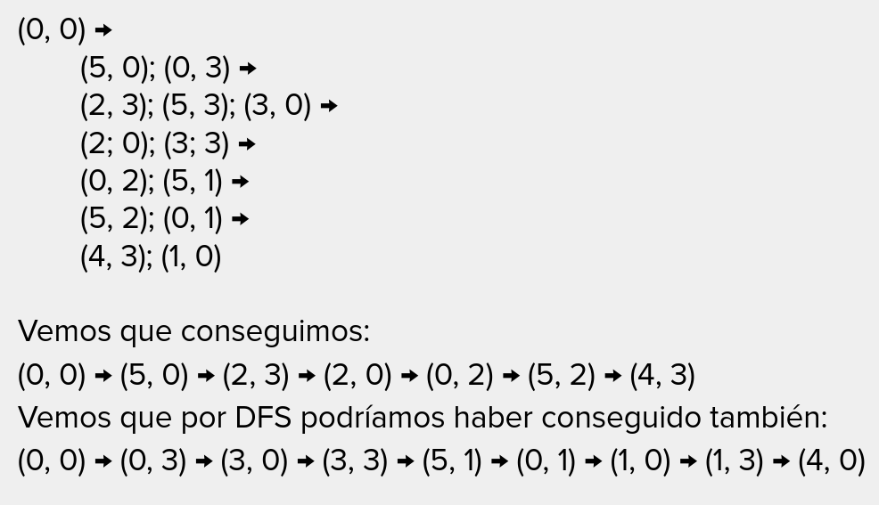

# PSPACE

## Complemento a un problema

Cuando tengamos que demostrar si algo es NP o no, el verificador va a recibir una solucion y el problema.

Definimos $\overline{X}$ como el complemento de un problema $X$. Es decir, es un problema donde algo que tenga solucion
en $X$ no la tiene $\overline{X}$ y viceversa.

La solucion de $\overline{X}$ es la negacion de la solucion de $X$.

Un ejemplo es $X$ = Problema del viajante.

Notar que si $X \in P \Rightarrow \overline{X} \in P$. Naturalmente, si soluciono rapido un problema, tambien puedo ver
si no tiene solucion rapidamente.

Y si $X \in NP$? No se sabe.

"Para todo camino/seleccion/..." sucede que no hay solucion.

### Clase "co-NP" es el complemento de NP.

Si un problema pertenece a NP $\rightarrow$ es facil demostrar cuando algo es solucion

Si un problema pertenece a co-NP $\rightarrow$ es facil demostrar que algo no es solucion/no tiene solucion.

### NP = co-NP?

No sabemos. Se cree que no y ademas si $NP \neq co-NP$ entonces $P \neq NP$.

Pero sabemos que $P \subseteq NP \cap co-NP$. Sabemos que si $X \in NP \Rightarrow \overline{X} \in co-NP$ y visceversa.

Problemas que se resuelven con un algoritmo que consume una cantidad polinomial de espacio

1. Mergesort $\in$ PSPACE
2. Fibonnaci $\in$ PSPACE
3. P $\in$ PSPACE

### Momento...

Supongamos que queremos contar desde 0 a $2^n - 1$. Si usamos un contador de n bits, necesitamos $n$ bits de espacio.
Por lo que necesito O(n) espacio (bits). Ya que para
representar $2^n - 1 = \underbrace{111111111....1111}_{\text{n bits}}$
Con una sola variable, esto ocupa O(n) espacio en total. $\therefore \in$ PSPACE

> _El espacio se puede reutilizar, pero el tiempo no_

Dado un juego de jarras donde tenemos una jarra (a, b) con la jarra $a$ con capacidad 5 y la jarra $b$ con capacidad 3.
Se busca jugar con las siguientes reglas:

1. Llenar una jarra
2. Vaciar una jarra
3. Pasar de una jarra a otra

El objtetivo final es tener 4 litros en la jarra $a$.

Seguimiento de BFS planteando un grafo con los estados posibles. Cada vertice es un estado posible.
Este grafo dirigido tiene todas las $2^n$ posibles configuraciones con aristas que representan las acciones posibles.
Ejemplo: de $(5, 0) \rightarrow (2, 3)$.

Existe un camino de $C_0$ a $C^*$?
En el peor de los casos tenemos que pasar por todos los estados posibles (O($2^n$)).

Resolvamos...

1. En lugar de crear el grafo de las configuraiocnes, vamos a crear el arbol de BFS.
2. Para cada posible $C'$ vem,oms que podemos llegar de $C_1$ a $C'$ en hasta $L/2$ pasos y de $C_2$ a $C'$ en
   hasta $L/2$ pasos. Esto logra que lleguemos de $C_1$ a $C_2$ en $L$ pasos.

