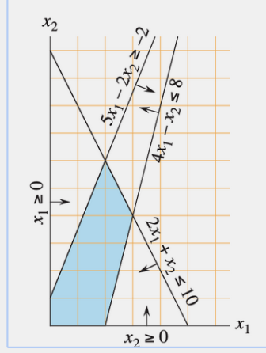
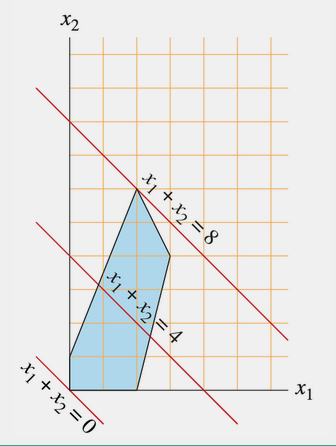
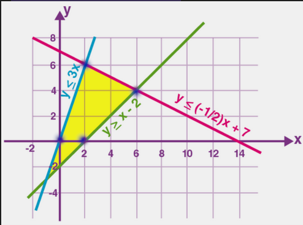

Permite resolver problemas de optimizacion de ecuaciones lineales

$cte_0 * x_0 + \dots + cte_n x_n  >= cte$$
1. Variabes
2. Ecuaciones e inecuaciones que definen las restricciones de las variables
3. Buscamos maximizar o minimizar una funcion objetivo: max $\sum\limits{c_i x_i}$
4. Luego aplicamos un algoritmo que resuelva el modelo lineal (Simplex)
### Dominios
* Las restricciones van a crear un dominio de soluciones válidas.
* No siempre hay soluciones validas

### Ejemplo 0
1. Variables: $x_1, x_2$
2. Restricciones:
    * $x_1, x_2 \geq 0$
    * $4x_1 - x_2 \leq 8$
    * $2x_1 + x_2 \leq 10$
    * $5x_1 - 2x_2 \geq -2$
3. Buscamos maximizar $x_1 + x_2$





Se puede notar que el valor maximo de la funcion $x_1 + x_2$ es 8. El punto donde se alcanza el maximo es aquel tangente a esa recta

### Importante
En problemas lineales continuos la solución óptima siempre va a estar en algún vértice (puede estar en otro punto, pero en un vértice va a estar sí o sí)

### Ejemplo 1
Tenemos una empresa TeoAlgoSoft que vende 2 comestibles por kilo: **x** e **y**. Por cuestiones normativas (Argentina, no lo entenderías) no podemos vender **y** en más kilos que el triple de **x**. Al mismo tiempo, la cantidad de x con el doble de y no puede exceder los 14 kgr. ¿Por qué? Vos seguime el ejemplo. Luego, la cantidad de kilos que exceda x a y no puede ser mayor a 2kgr. La ganancia del día puede verse por $5/kgr del producto x + $3/kgr del producto y.

1. Variables $x, y$
2. Restricciones:
    * $y \leq 3x$
    * $x + 2y \leq 14$
    * $x - y \leq 2$
    * $x, y \geq 0$
3. Maximizar $5x + 3y$

En la img se marcan los vertices y el Dominio de mi problema


Candidatos:
* $(0,0) \rightarrow 0$
* $(0,2) \rightarrow 6$
* $(2,6) \rightarrow 28$
* $(6,4) \rightarrow 42$
  Respuesta: $(6, 4)$

### Ejemplo 2
Nuestra empresa cereales tiene que cumplir con un pedido de al menos 100 kgr del producto estrella de la empresa para el final de la semana, para ser vendido en diferentes supermercados. Para elaborar el producto necesita de amaranto y frutos secos (misma cantidad de cada uno). Para esto contamos con dos proveedores: 
- Valle Patagua: nos vende a $1 el kilo de amaranto (máximo 40kgr)
- Salud Sustentable: nos vende cajas de 2 kgr de amaranto y 5 kgr de frutos rojos por $6 (máximo 30 cajas) → vamos a suponer inicialmente que se puede pedir proporción.
  ¿Modelo para minimizar los costos?

1. Variables: $AM, FSS$
2. Restricciones:
    * $AM + FSS \geq 100$ y $AM \geq FSS, FSS \geq AM$ se transforma en algo menos restrictivo. Que siempre lo menos restrictivo pero que cumpla es mejor:
    * $AM \geq 50$
    * $FSS \geq 50$
#### Un mejor modelo del problema:
1. Variables: $VP, SS$
2. Restricciones:
    * $5\cdot SS \geq 50$
    * $2\cdot SS + VP \geq 50$
    * $SS \geq 0$ -> este no es estrictamente necesario. Siempre podemos simplificar redundancias
    * $VP \geq 0$
    * $VP \leq 40$
    * $SS \leq 30$
1. Mininizar: $VP + SS$

```python
import pulp

def ejemplo():
    problem = pulp.LpProblem("products", pulp.LpMinimize)
    vp = pulp.LpVariable("vp")
    ss = pulp.LpVariable("ss")
    problem += vp <= 40
    problem += ss <= 30
    problem += 5 * ss >= 50  # mostrar cambiando a 51
    problem += vp + 2 * ss >= 50  # mostrar cambiando a 51
    problem += 1 * vp + 6 * ss
    problem.solve()
    return pulp.value(vp), pulp.value(ss)

def ejemplo_cajas_enteras():
    vp = pulp.LpVariable("vp")
    ss = pulp.LpVariable("ss", cat="Integer")
    problem = pulp.LpProblem("products", pulp.LpMinimize)
    problem += vp <= 40
    problem += ss <= 30
    problem += 5 * ss >= 51
    problem += vp + 2 * ss >= 51
    problem += 1 * vp + 6 * ss
    problem.solve()
    return pulp.value(vp), pulp.value(ss)

if __name__ == "__main__":
    x, y = ejemplo()
    print("Cantidad de kgr a Valle Patagua:", x, " - Cantidad de cajas de Salud Sustentable:", y)
    print("Costo:", x + 6 * y)
```
## Simplex
Busca el optimo entre los vertices

## Variables enteras
Hay casos donde las variables sólo pueden tomar valores enteros. Hay que indicar eso, y puede cambiar drásticamente la solución → **El algoritmo para buscar la solución es diferente!**

Esto puede llegar a cambiar la solucion.

## Utilidades
Aparte de lo obvio, nos permite tener "**Variables booleanas**/binarias" → Variables que valgan únicamente 0 o 1 → Sirven para problemas de decisión.

Ojo, cuidado con mantener que las ecuaciones sean lineales!

No podemos hacer $x_1y_1$.

### Ejemplo con variables booleanas
Tenemos que decidir si lanzamos diferentes productos (tenemos 6). Se deben lanzar al menos 3. Cada producto tiene un determinado costo o ganancia (y tenemos un presupuesto):

Lanzamos 3 al menos
$$\sum\limits_{i}{y_i} \geq 3$$ Costo o ganancia :
$$Z_{min} = \sum\limits_{i}{c_i y_i}$$

Regla nueva:
Si lanzamos el producto 5 o 6, deberiamos lanzar el 1 si o si: $$y_5 \leq y_1$$$$y_6 \leq y_1$$
Si se lanzan juntos los productos 3 y 4, nos ahorramos 100 pesos. Por lo que puedo definir una nueva variable en mi problema que se encargue de ese ahorro pero que no restriccione ni modifique las posibilidades de 3 ni 4 en lo absoluto.

$$y_{ahorro} \leq y_3$$
$$y_{ahorro} \leq y_4$$
Esto dice que si $y_3 = 0, y_{ahorro}$ debe ser 0. y si $y_4 = 0, y_{ahorro}$ debe ser 0.
Si  $y_3 = 1, y_{ahorro}$ puede ser 0 o 1. Si si $y_4 = 1, y_{ahorro}$ puede ser 0 o 1.

Para lograr que ambas condiciones con un `and` a $y_ahorro$ uso:
$$1 + y_{ahorro} \leq y_3 + y_4$$
**Donde solo se obliga a $y_{ahorro}$ a valer 1 cuando $y_3 = 1, y_4 = 1$.**

La ecuacion a minimizar termina siendo:
$$Z_{min} = c_1\cdot y_1 + c_2\cdot y_2 + c_3\cdot y_3 + c_4\cdot y_4 + c_5\cdot y_5 + c_6\cdot y_6 - 100\cdot y_{ahorro}$$

## Problema de la mochila
Constantes: $W, [v_1, \dots, v_n], [w_1, \dots, w_n]$
1. Variables: $[y_1, \dots, y_n]$
    1. Las variables $y_i$ son booleanas y definen si lo agarre o no.
2. Restricciones:
    * $\sum\limits w_i y_i \leq W$
3. max $\sum\limits_{i} v_i y_i$

```python
from typing import List

import pulp
from pulp import LpAffineExpression as Sumatoria


def cargar_mochila(ruta):
    w = []
    v = []
    with open(ruta) as f:
        W = int(f.readline().strip())
        for l in f:
            vi, wi = l.strip().split(",")
            w.append(int(wi))
            v.append(int(vi))
    return v, w, W


def mochila_variable(v: List[int], w: List[int], W: int):
    y = []
    for i in range(len(v)):
        y.append(pulp.LpVariable("y" + str(i), cat="Binary"))

    problem = pulp.LpProblem("products", pulp.LpMaximize)
    problem += Sumatoria([(y[i], w[i]) for i in range(len(y))]) <= W
    problem += Sumatoria([(y[i], v[i]) for i in range(len(y))])

	 # agrega variables binarias (booleanas) y restricciones

    problem.solve()
    return list(map(lambda yi: pulp.value(yi), y))


if __name__ == "__main__":
    valores, pesos, W = cargar_mochila("mochila.txt")
    y = mochila_variable(valores, pesos, W)
    print(y)
    print("Peso usado:", sum([pesos[i] * y[i] for i in range(len(y))]))
    print("Valor obtenido:", sum([valores[i] * y[i] for i in range(len(y))]))
```

Simplex en el peor de los casos tarda $O(n^9)$, $n: \text{ cantidad de variables }$. En la practica es mejor que eso. **CUIDADO!** Si ponemos alguna variable como **entera**, la complejidad se vuelve exponencial.


## Probelma del Viajante por PLE

1. Agregamos virtualmente las aristas faltantes con peso F = "infinito" (=sumatoria de todas las aristas existentes + 1)
2. Vamos a construir nuestras variables Y$_{i,i} = 1$ si usamos la arista i -> j (0 sino).
3. $\sum_i Y_{i,j}$

Agregamos una variable $p_i$: numero de secuencia en la cual visito a la ciudad i.

## Vertex Cover

* $Y_i$: El vertice $i$ se encuentra en el VC. si $$\forall (v,w)\in E : Y_v + Y_w \geq 1$$
* min $\sum_i Y_i$

Mejorar el modelo:
> Si un vertice no esta en el conjunto, entonces todos sus adyacentes deben estar en el conjunto.

$\forall i \in V:$ $$ Y_i + \sum_{j\in ady(i)} Y_k \geq len(ady(i)) \cdot (1-Y_i)$$

$(1-Y_i) = 1$ si $i$ no esta en el VC. $0$ si $i$ esta en el VC.

## FLujo Maximo

* $\sum_{v\in V} f^{in}(v) = \sum_{v\in V} f^{out}(v)$ para todo vertice $v$.
* $f(e) \leq c(e)$ para todo eje $e$.
* $f^{in}(s) = 0$ y $f^{out}(t) = 0$.
* $max \Big(\sum_{v\in V} f^{in}(f) \Big)$

$f$ : flujo que consume / pasa por el eje.

