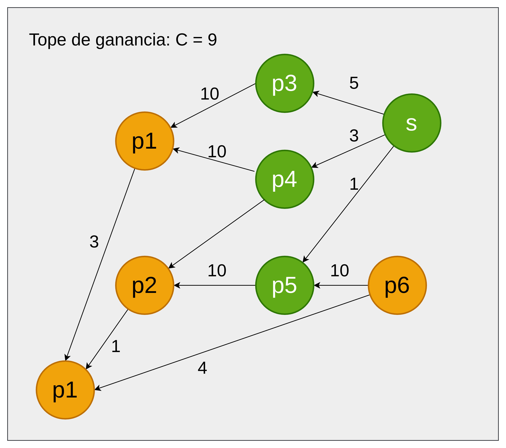

# Redes de flujo

* Podemos modelar con grafos flujos de materiales (ej cloacas, información en redes).
* El grafo es dirigido.
* Tenemos una (única) fuente, y un (único) sumidero ( → una única componente débilmente conexa). Fuente: vértice con
  grado de entrada 0. Sumidero: vértice de grado de salida 0.
* Cada vértice intermedio simplemente traslada lo que le pasan. No produce ni consume. → Conservación de la materia,
  energía, carga eléctrica, etc...
* Cada arista tiene un peso que refleja la capacidad de transporte por esa vía.


## Restricciones

1. No se aceptan bucles
2. No pueden haber ciclos de 2 vertices
3. Solo debe haber una fuente y un sumidero

### 1. Si hay bucles: los sacamos

### 2. Si hay ciclos de 2 vertices: los convierto


### 3. Si hay más de una fuente o sumidero: los convierto


Red residual

* Tendra los mismos vertices que la red original
* Tendra las mismas aristas, con la capacidad que les quede (inicia en w(A,B)).
* Tendra aristas inversas, con la capacidad que se haya usado (inicia en 0)

## Algoritmo de Ford-Fulkerson

Si encontramos un camino de la fuente al sumidero en la red residual, entonces encontramos un camino por el que podemos
aumentar el flujo.

## Corte minimo

El corte minimo de una red es la suma de los pesos de las aristas que al eliminarlas, desconectan la fuente del
sumidero.
Si el grafo es no pesado, puedo considedar a todas las aristas con peso 1. Por lo que el corto minimo es la cantidad de
aristas que desconectan la fuente del sumidero.

Esto aplica a cualquier tipo de grafo

Corte minimo en este recorrido: 9


## Teorema de max-flow min-cut


Si el grafo corresponde a una red de flujo, entonces el flujo máximo es igual al corte mínimo.

## Definiciones

El flujo es igual al flujo de todos los vertices a $t$ y al flujo desde $s$ a todos los vertices.

$$ |f| = f(V,t) $$
$$ |f| = f(s,V) $$

## Cuts

A cut $(S,T)$ of a flow net $G = (V,E)$ is a **partition** of V such that $s\in S$ and $t\in T$. If $f$ is a flow on G,
then the flow accros the cut is $f(S,T)$.


The flow accross the cut is:
$f(S,T) = f(s,b) + f(a,b) + f(d,b) + f(d,t) = 2 - 0 + 1 + 2 = 5$

### Capacity of a cut

$$ c(S,T) = \sum_{(u,v) \in E} c(u,v) $$

The capacity of the cut in the image is:
$ c(S,T) = c(s,b) + c(d,b) + c(d,t) = 2 + 1 + 3 = 6$

Value of **any** flow $f$ is less than or equal to the capacity of **any** cut $(S,T)$.

$$ f(S,T) \leq c(S,T) $$

### Lemma

For any flow $f$ and any cut (S,T) we have $|f| = f(S,T)$

Proof:
$f(S,T)=f(S,V) - f(S,S) = f(S,V) = f(s,V) + f(S-s,V)$ where $S-s$ does not contain t.

## Residual Network G(V,E)

$G_f(V,E_f)$ is the residual network of $G(V,E)$ and flow $f$. stirctly positive capacity residual capacities..

$c_f(u,v) = c(u,v) - f(u,v) > o$. Edges in $E_f$ admit more flow.

If $(v,u) \notin E, c(v,u) = 0$ but $f(u,v)=-f(v,u)$


## Augmenting Path

Are defined in the residual network. It is a path from $s$ to $t$ in $G_f$.

## Ford-Fulkerson Algorithm

#### Book

```
augment(f, P)
    Let b = bottleneck(P, f)
    for each edge e in P
        if e is a forward edge
            f(e) = f(e) + b
        else
            f(e) = f(e) - b

Max-Flow
    Initially f(e) = 0 fol all e in G
    While there is an s-t path in the residual graph G_f
        Let P be a simple s-t path in G_f
        f' = augment(f, P)
        Update f to be f'
        Update the residual graph G_f to be G_f'
    Return f
```

#### MIT

1. Start with $f(u,v) = 0$ for all $u,v \in V$
2. While there is an augmenting path $p$ in $G_f$: (compute $G_f$ given $f$)
    * Find the minimum residual capacity $c_f(p)$
    * Augment the flow along $p$ by $c_f(p)$
    * Update the residual network $G_f$. The flow is now $f`$

**The Residual Graph** Given a flow network $G$, and a flow $f$ on $G$, we define
the residual graph $G_f$ of $G$ with respect to f as follows:

* The node set of Gf is the same as that of G.
* For each edge $e = (u, v)$ of $G$ on which $f (e) < c(e)$, there are $c(e) − f (e)$
  “leftover” units of capacity on which we could try pushing flow forward. So we include the edge $e = (u, v)$
  in $G_f$ ,
  with a capacity of $c(e) − f (e)$. We will call edges included this way forward edges.
* For each edge $e = (u, v)$ of G on which $f (e) > 0$, there are f (e) units of flow that we can “undo” if we want to,
  by
  pushing flow backward. So we include the edge $e' = (v, u)$ in $G_f$ , with a capacity of f (e). Note that $e'$ has
  the same
  ends as e, but its
  direction is reversed; we will call edges included this way backward edges.

Some points to say about the next img:

1. The flow is 0 for all newly generated edges.
2. The flow, after finding and augmenting path, will be aumented through that path by the minimum capacity of the edges
   that form the path.
3. After augmenting the flow, the new edges must be coputed following the rules:
    * If any edge $e$ has positive flow, then there will be a backward edge $e'$. If there already was a backward
      edge $e''$, then the
      capacity of $e'$ will be the $f(e) + c(e'')$.
    * Else, the capacity of the edge $e'$ will be $c(e) - f(e)$.
    * If any edge $e$ has positive flow, then we check if there is residual capacity. That is, if $c(e) > f(e)$, then we
      create the fordward edge $e'$ with capacity $c(e) - f(e)$.
   


Paso 1:

* $f(s,a) = 0, f(a,t) = 0$
* Aumento el flujo por el camino $s \rightarrow a \rightarrow t$ en 1


* $G_f$
* $c_f(s,a) = 2 - 1 = 1$
* $c_f(a,t) = 4 - 1 = 3$
* Uso ese camino para aumentar el flujo, donde el maximo valor posible para aumentar $s \rightarrow a \rightarrow t$ es
    1.


* Termino con este camino


Ya no quedan caminos (augmenting paths) en $G_f$


## Max Flow Min Cut Theorem

The following are equivalent:

1. $|f| = c(S,T)$ for some cut (S,T)
2. $f$ is a max flow
3. $f$ admits no augmenting paths

## Problema de usar DFS:


En este grafo, el uso de DFS puede lograr que se tome el camino largo siempre ($s \rightarrow b \rightarrow a
\rightarrow t$) cada vez y termine tomando demasiado.
Por lo que lo mejor es usar **BFS**.

### BFS Edmonds Karp

BFS-augmenting path: a shortest path in $G_f$ from $s$ to $t$ where each edge has weight 1.

* Each augmentation takes $O(E)$ time:
    * each augmentation involves two main steps:
        1. Finding an augmenting path using BFS, which takes O(V + E) time.
        2. Updating the flow along this path, which takes O(E) time in the worst case.
    * Since E ≥ V-1 in a connected graph, O(V + E) simplifies to O(E). Thus, the overall time for each augmentation is
      O(E).
* $O(VE)$ augmentations in the worst case.
* Overall complexity: $O(VE^2)$.

Example:
Baseball Elimination Problem

| Positions | Team      | Wins $w_i$ | Losses $l_i$ | Remaining $r_i$ | against each other $r_i,j$ |
|-----------|-----------|------------|--------------|-----------------|----------------------------|
| 1         | NY        | 75         | 59           | 28              | - 5 7 4 3                  |
| 2         | Baltimore | 71         | 63           | 28              | 5 - 2 4 4                  |
| 3         | Boston    | 69         | 65           | 28              | 7 2 - 4 0                  |
| 4         | Toronto   | 63         | 71           | 28              | 4 4 4 - 0                  |
| 5         | Detroit   | # **?**    | # **?**      | 28              | 3 4 0 0 -                  |

* Team $i$ is eliminated if $w_i + r_i < w_j$ for some $j$. That team has won more games than team $i$ can possibly win.

* Detroit $w_5 = 46, l_5 = 88$ so $46 + 28 = 74 < 75$. So this is **sufficient, but not necessary**.
* **WHAT IF** $w_5 = 47$? Then $47 + 28 = 75 = 75$. BUT Detroit is still eliminated because:
    * $w_5 + r_5 = 75$ and either NY or Baltimore will win 76 games since they play each other 5 times.
* **WHAT IF** $w_5 = 48$?

Let's desing a flow network to determine if team 5 (Detroit) is eliminated


The capacities from $i \rightarrow t$ (1 to t, 2 to t...) are #games team $i$ can win and not have more wins than team

5. Each capacity, then, was formulated by $w_5 + r_5 - w_i = 48 + 28 - w_i$

* Assume team 5 wins all remaining games. Divvy up remaining games -> send flow through the edges of the network G. So
  all teams have $\leq w_5 + r_5$ wins. If that happens, Team 5 is not eliminated.

**Therem**: Team 5 is eliminated iff max-flow does not saturate all edges leaving the source (ie maxflow \leq 26).
Saturation of thos edges corresponds to playing all remaining games.

**Argument**: if you cannot play all the remaining games without exciding the capacity of $i \rightarrow t$ edges, then
team 5 is eliminated.

**If you can get a max-flow that is $<$ 26** you have saturated all the edges and found a team that beats team 5.

$4 + 4 + 4 + 1 + 5 + 7 = 25 < 26$ so Detroit is eliminated.

## Applications

### Bipartite Matching

Given a bipartite graph of people and jobs, find the maximum number of people that can be matched to jobs. So how many
tasks can we handle?
If there is an edge (X,i) then X can do job i.


1. Add a source and sink and edges (s,X) , (i,t)
2. Restrict the capacities of each edge (s,X) and (i,t) to 1.
3. Then $|f| = k =$ max matching. (max number of tasks possible)
   

# Notation from the book

* $f : E \rightarrow \mathbb{R}^+$: s-t _flow_ that maps each edge $e$ to a nonnegative real number.
* $f(e)$: amount of flow carried by edge $e$.
* Capacity condition: $0 \leq f(e) \leq c(e)$: capacity constraint.
* Conservation condition: For each node $v$ other than $s$ and $t$ we
  have: $\sum_{\text{e into v}} f(e) = \sum_{\text{e out of v}} f(e)$
* $v(f) = \sum_{\text{e out of s}} f(e) = f^{\text{out}}(v)$ : _value_ of a flow $f$ (total flow out of the source).
* c(A, B) = $\sum_{u \in A, v \in B} c(u, v) = \sum_{\text{e out of A}} c(e)$: capacity of the cut (A, B).
* 