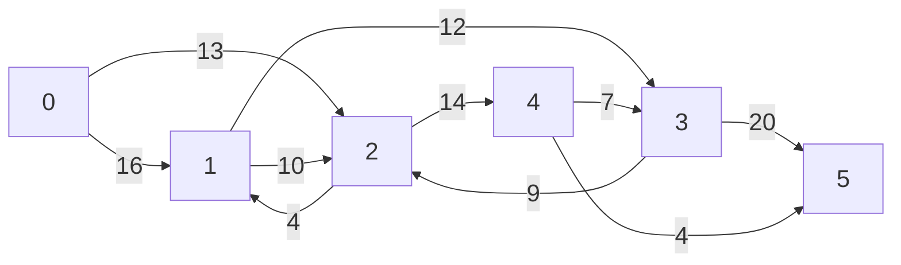
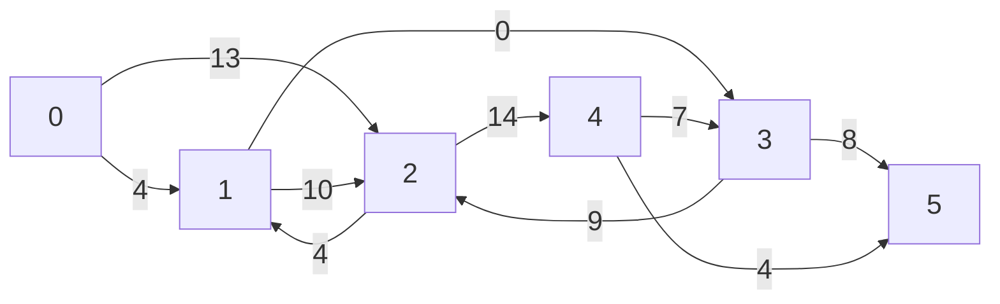
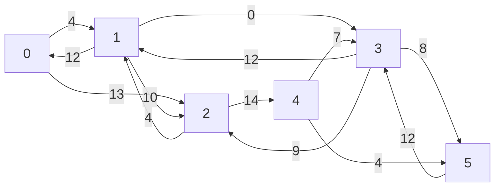
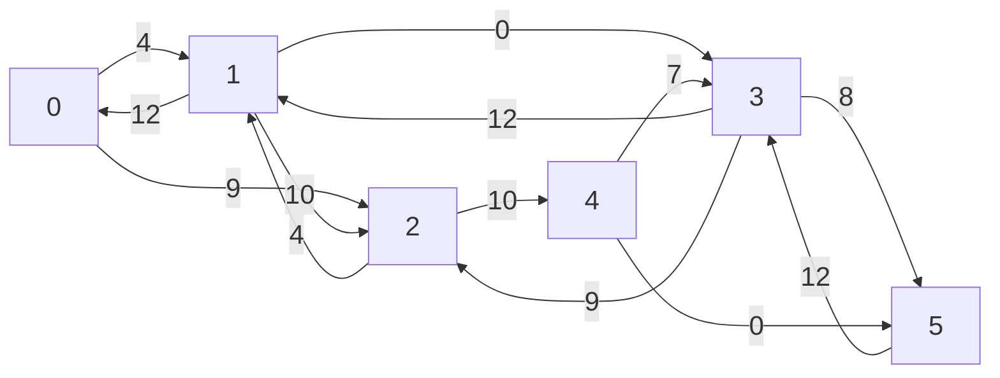
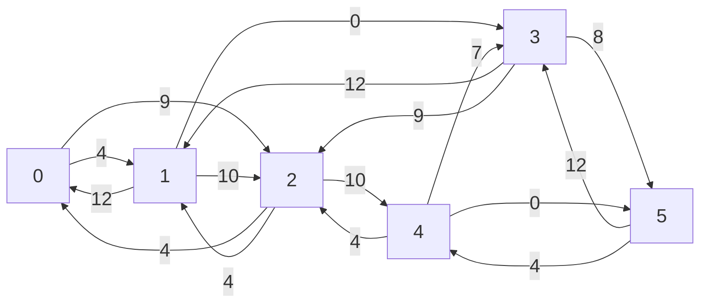
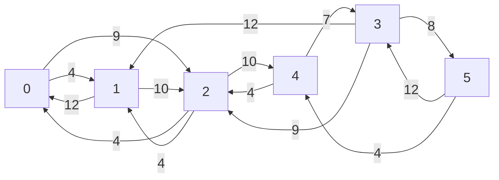
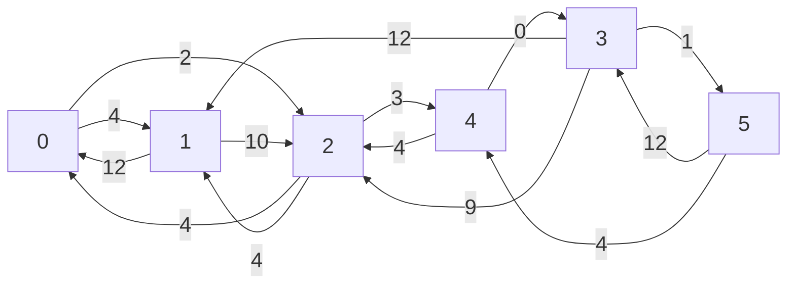
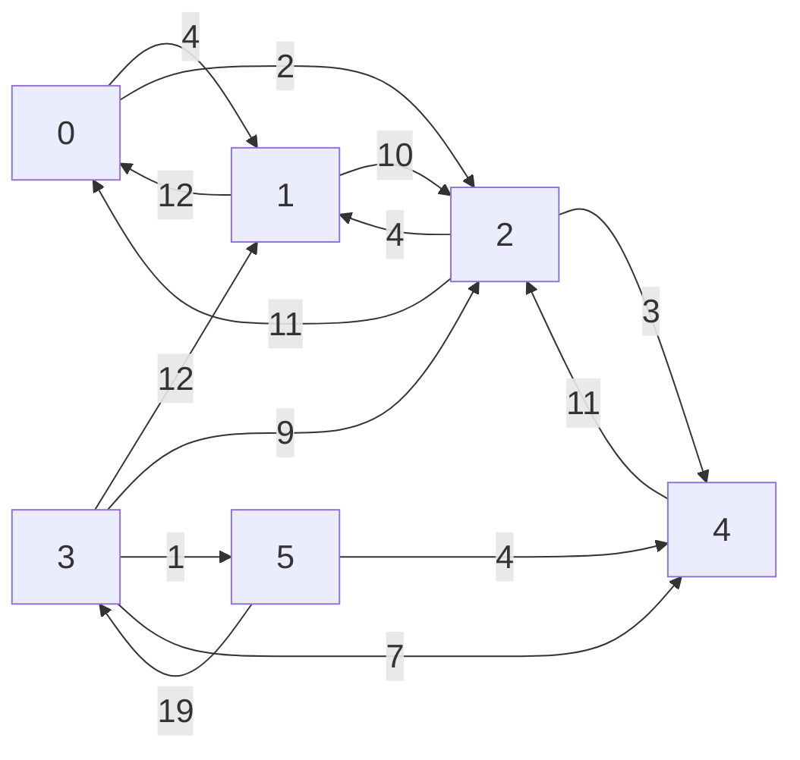
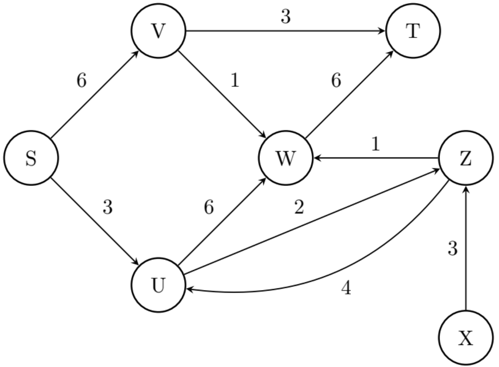
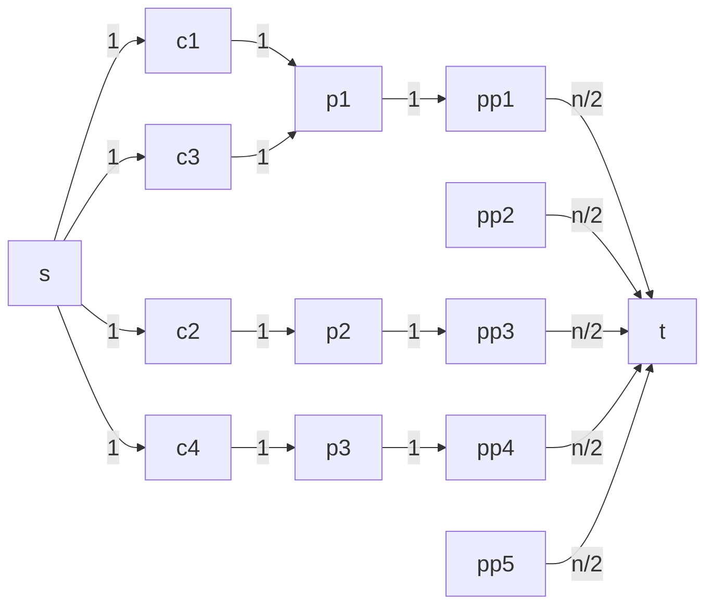

Augmenting path: 0-1-3-5 (by 12)



Resulting $G_f$



Augmenting path: 0 - 2 - 4 - 5 (by 4)



Resulting $G_f$



Cleaning it up
Resulting $G_f$



Augmenting path: 0 - 2 - 4 - 3 - 5 (by 7)



Resulting $G_f$ cleaned up



# Ejercicio Seguimiento 1 rpl




# Ejercicio en clase

## Modificacion al flujo maximo

Dado un flujo maximo de un grafo, implementar un aglritmo que, si se le aumenta la capacidad a una arista, permita
obtener el nuevo flujo maximo en tiempo luenal en vertices y aristas. Indicar y justificar la complejidad del algoritmo
implementado.

# Ejercicio 6 Guia

(★★) Hacer un seguimiento de obtener el flujo máximo en la siguient red de transporte, realizando las modificaciones
previas que fueran necesarias. Luego, definir cuáles son los dos conjuntos del corte mínimo en dicha red.


# Redes: Ford Fulkerson

## Modificacion al flujo maximo

Dado un flujo maximo de un grafo, implementar un aglritmo que, si se le aumenta en una unidad la capacidad a una arista,
permita
obtener el nuevo flujo maximo en tiempo luenal en vertices y aristas. Indicar y justificar la complejidad del algoritmo
implementado.

Se debe hacer una itracion del FF (un bfs) para encontrar el camino de aumento y aumentarlo.

## Modelacion usando Redes de Flujo

Se está formando una nueva comisión de actividades culturales de un pueblo.

* Cada habitante es miembro de 0 o más clubes, y de exactamente 1 partido político.
* Cada grupo de interés debe nombrar a un representante ante la nueva comisión de
  actividades culturales, con las siguientes restricciones:
    * cada partido político no puede tener más de $n/2$ simpatizantes en la comisión,
    * cada persona puede representar a solo un club,
    * cada club debe estar representado por un miembro.
    * $n$ es la cantidad de clubes que hay y queremos ver si hay $n$ representantes y cuales son.

Implementar un algoritmo que dada la información de los habitantes (a qué clubes son miembros, a qué partido
pertenecen), nos dé una lista de representantes válidos. Indicar y justificar la complejidad del algoritmo
implementado.



NO es necesario que todos los partidos politicos esten representados.
El flujo puede elegir para alguna persona que tiene k clubes a las que esta asociado, un solo club. Por lo que el
algoritmo genera un conjunto posible de representantes que podrian tener otras soluciones posibles (si es que se usa la
arista de otro club)

```python
class Persona:
    def __init__(self, ):
        self.clubes = []
        self.partido = ""
        self.nombre = ""

def sol(personas, n): # n: cant de clubes en total
    grafo = Grafo(dirigido=True)
    grafo.agregar_vertice("s")
    grafo.agregar_vertice("t")    
    for p in personas:
        grafo.agregar_vertice(p.nombre)
        for club in p.clubes:
            if club not in grafo.vertices:
                grafo.agregar_vertice(club)
                grafo.agregar_arista("s", club, 1)
            grafo.agregar_arista(club, p.nombre, 1)
        if p.partido not in grafo.vertices:
            grafo.agregar_vertice(p.partido)
            grafo.agregar_arista("t", p.partido, 1)
            grafo.agregar_arista(p.nombre, p.partido, 1)
    
    flujo_maximo = FordFulkerson(grafo, "s", "t")
    representantes = set()
    for p in personas:
        if flujo_maximo.flujo("s", p.nombre) == 1:
            representantes.add(p.nombre)
    if len(representantes) == n:
        return representantes
    else:
        return None
```

$O(V * E) = O( (p + n + pp) \cdot (n + pp + p + afiliados) )$

# Ejercicio RPL seguimiento

