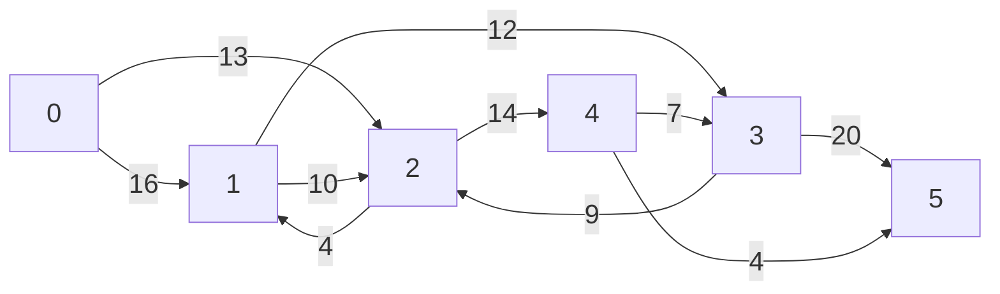
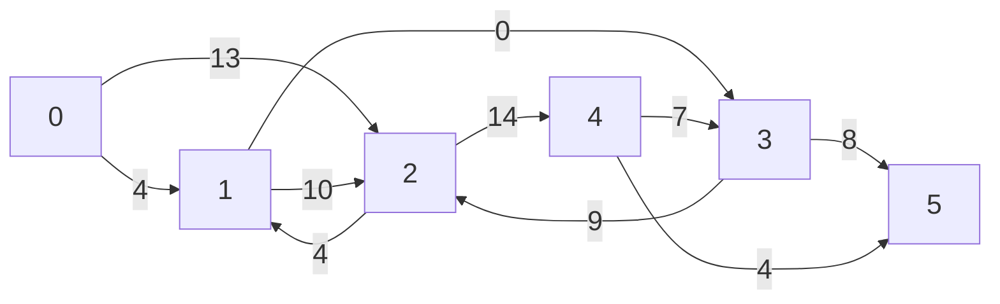
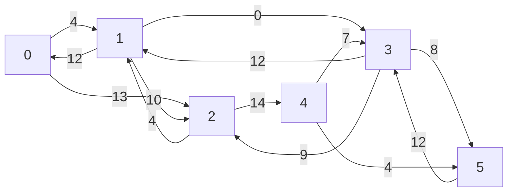
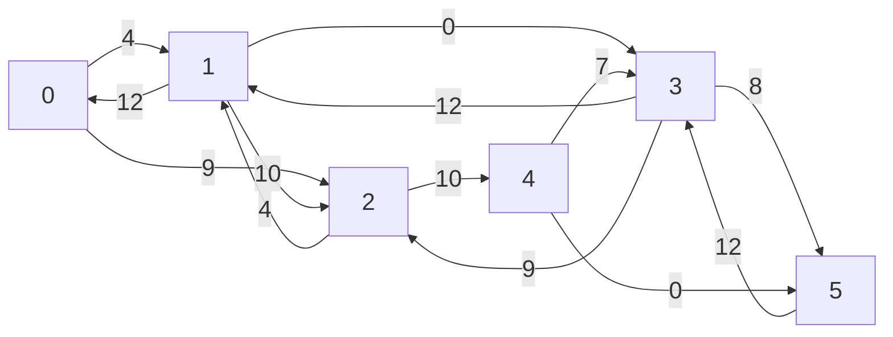
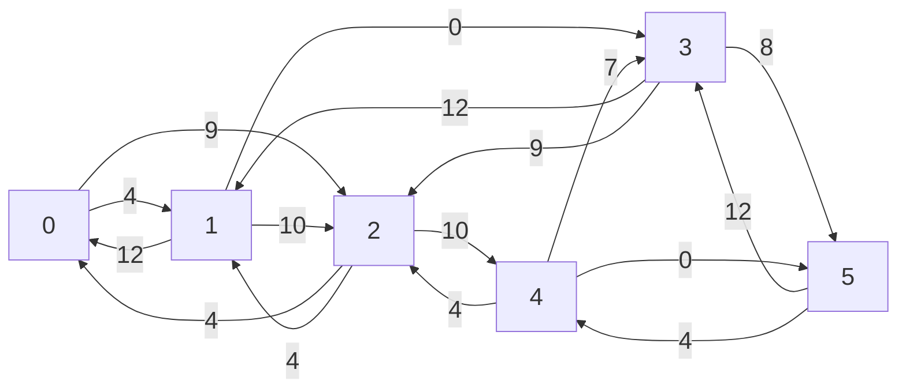
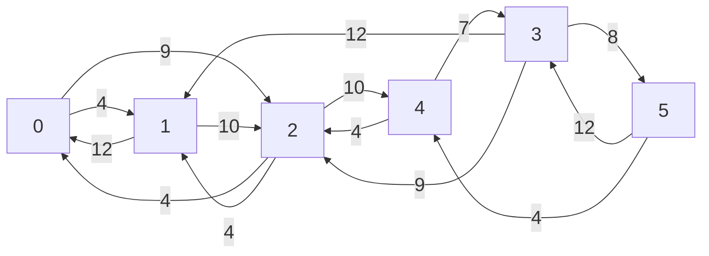
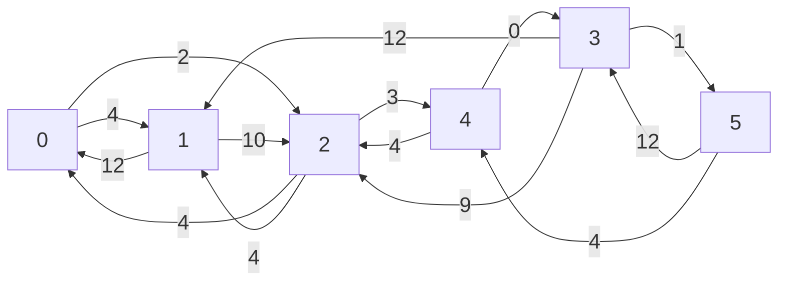
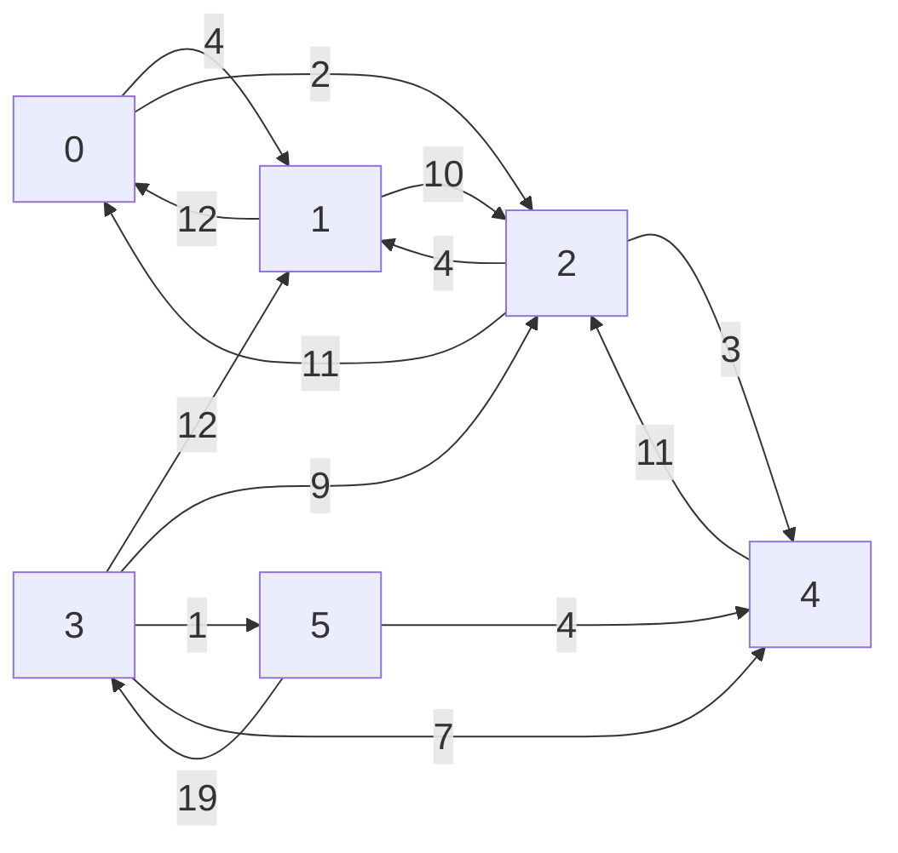

Augmenting path: 0-1-3-5 (by 12)

Resulting $G_f$

Augmenting path: 0 - 2 - 4 - 5 (by 4)

Resulting $G_f$

Cleaning it up
Resulting $G_f$

Augmenting path: 0 - 2 - 4 - 3 - 5 (by 7)

Resulting $G_f$ cleaned up
