Dado un grafo no dirigido, un match es un subconjunto de las aristas en el cual para todo vértice V a lo sumo una arista
del match incide en V (en el match, tienen grado a lo sumo 1). Decimos que el vértice v está matcheado si hay alguna
arista que incida en él (sino, está unmatcheado). El matching máximo es aquel en el que tenemos la mayor cantidad de
aristas (matcheamos la mayor cantidad posible).

> Problema: Dado cualquier grafo bipartito, encontrar el mejor matching.

Sea G el grafo bipartito.

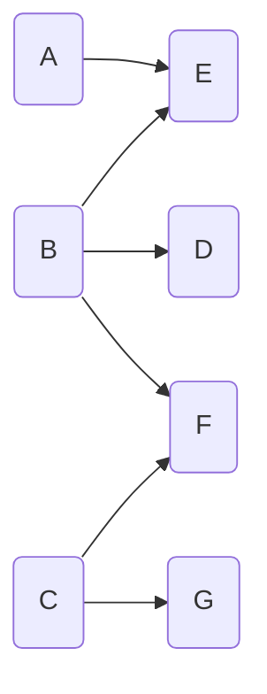
```mermaid
graph LR
    A(A)
    B(B)
    C(C)
    D(D)
    E(E)
    F(F)
    G(G)
    A --> E
    B --> D
    B --> E
    B --> F
    C --> F
    C --> G
```

Pasos para resolver:

1. Se crea un nuevo grafo agregando dos nodos s y t.
2. Se le coloca a todas las aristas un peso de 1.
3. Luego, se le aplica el algoritmo de Ford Fulkerson.
4. Se obtiene el matching máximo. Siendo $k = |f|$ la cantidad de aristas en el matching, entonces $k$ es el matching
   máximo.

#### Conclusiones:

> The size of the maximum matching in $G$ is equal to the value of the
> maximum flow in $G'$; and the edges in such a matching in $G$ are the edges that
> carry flow from $X$ to $Y$ in $G'$.

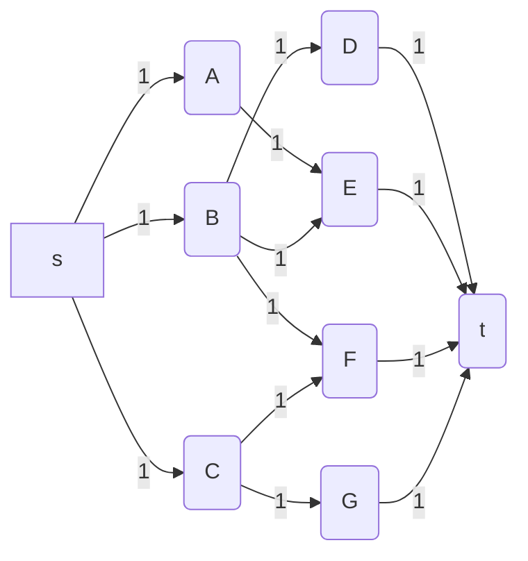
```mermaid
graph LR
    A(A)
    B(B)
    C(C)
    D(D)
    E(E)
    F(F)
    G(G)
    t(t)
    s -->|1| A
    s -->|1| B
    s -->|1| C
    A -->|1| E
    B -->|1| D
    B -->|1| E
    B -->|1| F
    C -->|1| F
    C -->|1| G
    D -->|1| t
    E -->|1| t
    F -->|1| t
    G -->|1| t
```

Con Ford Fulkerson tenemos tipicamente a $O(E \cdot V^2)$. Pero

## Caminos disjuntos

Decimos que dos caminos son disjuntos si no comparten aristas (pueden compartir nodos).
Dado un grafo dirigido y dos vértices s y t, encontrar el máximo número de caminos disjuntos s-t en G.
Pro-tip: recuerden cómo funciona FF

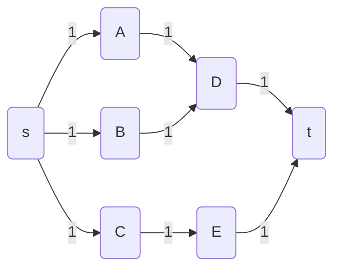
```mermaid
graph LR
    s(s)
    A(A)
    B(B)
    C(C)
    D(D)
    E(E)
    t(t)
    s -->|1| A
    s -->|1| B
    A -->|1| D
    B -->|1| D
    C -->|1| E
    s -->|1| C
    D -->|1| t
    E -->|1| t
```

Puedo usar FF para encontrar caminos disjuntos de forma progresiva. EN cada iteracion se encuentra el camino mas cercano
progresivamente usando BFS-FF. Luego, se bloquean (o *eliminan*) las aristas de ese camino y se vuelve a buscar otro
camino.

## Caminos disjuntos no dirigidas

Para caminos disjuntos no dirigidos, se fuerza al grafo a ser dirigido mientras sigue cumpliendo con las antiparalelas.

Del grafo:

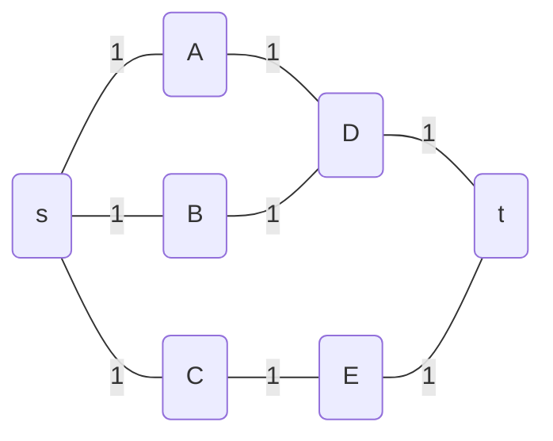
```mermaid
graph LR
    s(s)
    A(A)
    B(B)
    C(C)
    D(D)
    E(E)
    t(t)
    s ---|1| A
    s ---|1| B
    A ---|1| D
    B ---|1| D
    C ---|1| E
    s ---|1| C
    D ---|1| t
    E ---|1| t
```

Paso a:

Estrategia:
S para por algun vertice `u` aprovechando el camino de `u`->`v`.

## Circulaciones con demandas

Supongamos que tenemos varias "fuentes" con un suministro, y "sumideros" con una demanda. Ahora cada nodo tiene una
demanda (positiva, negativa o 0).

En grafos normales, **sin demanda**, teniamos que $f_{in}(v) - f_{out}(v) = 0$. Ahora deciemos que para grafos con
demandas, puede ocurrir que el nodo `u` tenga:
$f_{in}(u) - f_{out}(u) = d$. Lo que aparece dentro de cada nodo es lo que quiere consumir. Si aparece negativo, es
porque lo produce.

> A produce 3. Los que tengan demanda negativa producen.

Nuevas condiciones

1. $0 \leq f(e) \leq c_e$ : el flujo de un eje esta acotado por su capacidad
2. $f_{in}(u) - f_{out}(u) = d$ : la demanda de un nodo es igual a la suma de lo que entra menos lo que sale.

Por lo que para que exista una solucion a este problema de circulación, se debe cumplir:
$\sum d_v = 0 $. Es decir, $\sum f^{in}(v)-\sum f^{out}(v) = 0$. Por lo que todas las demandas del grafo deben sumar 0.

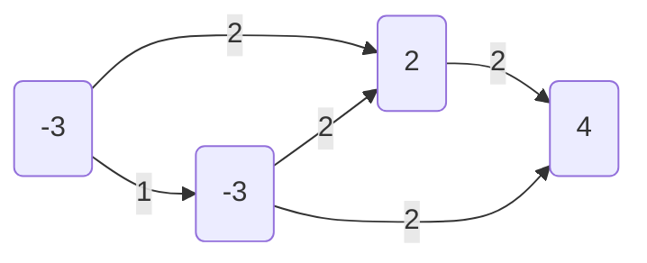
```mermaid 
graph LR
    A("-3") -->|2| C(2)
    A -->|1| B("-3") -->|2| C
    B -->|2| D(4)
    C -->|2| D
```

Podemos re-escribir el grafo $G$ a $G'$ de la siguiente forma:

1. Agregando un nodo `s` que va a ser la fuente de los nodos con demanda negativa. Este supor nodo `s` tiene como
   finalidad generar esa demanda que generaban los nodos con demanda negativa.
2. Agregando un nodo `t` que tiene como finalidad absorber la demanda de los nodos con demanda positiva.
3. Dejando las capacidades intactas.

Ademas, considerando todos los vertices v con demandas positivas $\sum_{d_v > 0} d_v = D$ se sabe que el
corte $(A, B) = (s, V - s)$ tiene una capacidad $c(A, B) = D$. Luego, el flujo maximo del grafo $G'$ es D **sii** es
posible la circulacion con demandas de $G$. Esto si es que se cumple que $\sum d_v = 0$ para toda demanda.

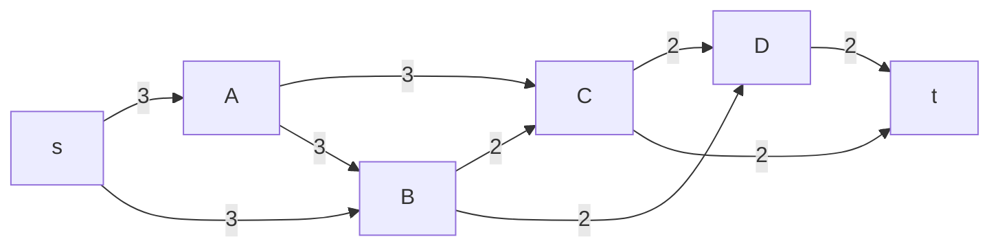
```mermaid
graph LR
    s -->|3| A -->|3| C
    A -->|3| B -->|2| C
    s -->|3| B -->|2| D
    C -->|2| D -->|2| t
    C -->|2| t
```

Finalmente, se puede aplicar el algoritmo de FF para encontrar la circulación máxima.

## Ejercicio

Supongamos que tenemos un sistema de una facultad en el que cada alumno puede pedir hasta 10 libros de la biblioteca. La
biblioteca tiene 3 copias de cada libro. Cada alumno desea pedir libros diferentes. Implementar un algoritmo que nos
permita obtener la forma de asignar libros a alumnos de tal forma que la cantidad de préstamos sea máxima.

Modelo diciendo que cada libro puede ser prestado a lo sumo 3 veces. Cada alumno puede pedir hasta 10 libros. Cada libro
puede ser prestado a un alumno puntual 1 sola vez.

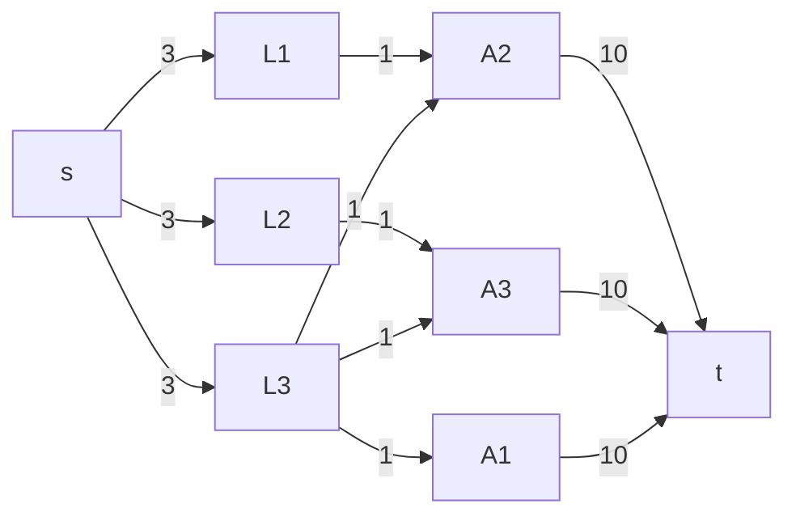
```mermaid
graph LR
    s -->|3| L1 -->|1| A2 -->|10| t
    s -->|3| L2 -->|1| A3 -->|10| t
    s -->|3| L3 -->|1| A1 -->|10| t
    L3 -->|1| A2
    L3 -->|1| A3
```

Alternativa:

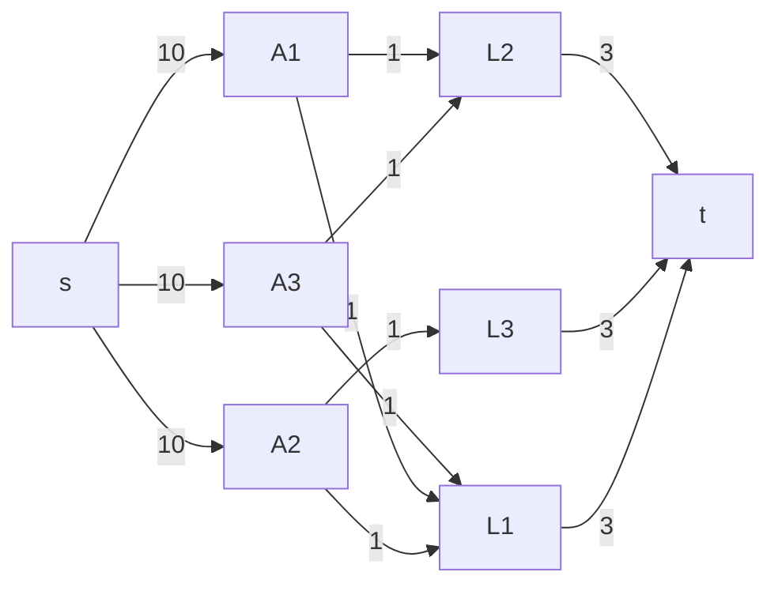
```mermaid
graph LR
    s -->|10| A1 -->|1| L2 -->|3| t
    s -->|10| A2 -->|1| L3 -->|3| t
    s -->|10| A3 -->|1| L1 -->|3| t
    A3 -->|1| L2
    A1 -->|1| L1
    A2 -->|1| L1
```

Un grafo G tiene una circulación factible con demandas sii para todos los cortes (A, B):
$$
\sum_{v \in B} d_v \leq c(A,B)
$$

## Circulacion con demandas y cotas minimas

Ahora para cada arista, ademas de tener una capacidad tenemos una cota inferior que **debe** cumplirse.

Nuevas condiciones

1. $l_e \leq f(e) \leq c_e$ : el flujo de un eje esta acotado por su capacidad y cota minima.
2. $f_{in}(u) - f_{out}(u) = d$ : la demanda de un nodo es igual a la suma de lo que entra menos lo que sale.

Dado un grafo $G$ con demandas y cotas minimas, se puede generar $G'$ con las siguientes reglas:

0. Definir en primer lugar:
    * $L_v = f_0^{\text{in}}(v) - f_0^{\text{out}}(v) = \sum_{\text{e into v}} l_e - \sum_{\text{e out of v}} l_e$: El
      flujo entrante menos el saliente de un vertie es igual a $L_v$. Aca el 0 indica que es el flujo inicial.
1. Hacer que la demanda del vertice $v$ sea $d - L_{v}$. Es decir, hacer que la demanda de un vertice sea la
   demanda original **menos** la sumatoria de las demandas entrantes menos las demandas salientes.
2. La capacidad de cada eje $e$ sera $c_e - l_e$.

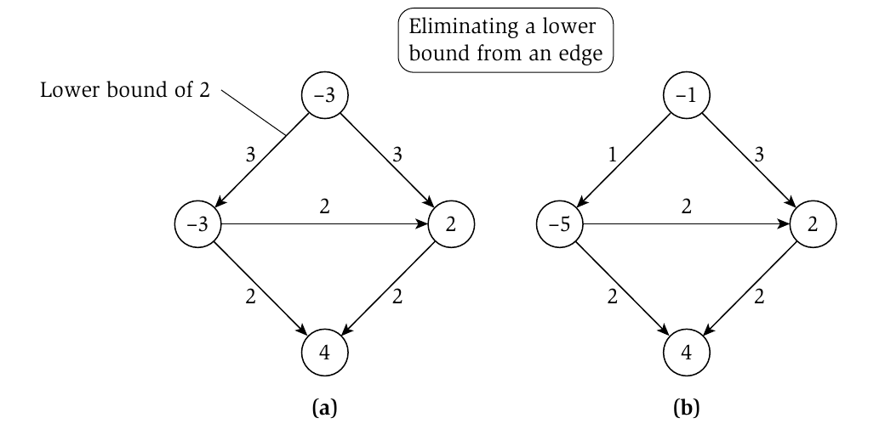
En la imagen se puede ver como el unico eje con cota minima tiene $l_e = 2$. El vertice al que dicho eje inside lo
llamaremos $v$. Donde $v$ tiene $d_v = -3$ por lo que genera 3. Ademaas, $v$ no posee otro eje con demanda y resulta
$\sum_{\text{e into v}} l_e - \sum_{\text{e out of v}} l_e = 2 - 0 = 2 = L_v$. Donde se ve que:

1. La nueva demanda de $v$ se calcula $d - L_v = -3 - 2 = -5$.
2. La nueva capacidad del eje $e$ es $c_e - l_e = 3 - 2 = 1$.

> Luego, solo queda resolver el nuevo problema que es el de circulación con demandas.

3. Agregar un nodo `s` que va a ser la fuente de los nodos con demanda negativa. Este supor nodo `s` tiene como
   finalidad generar esa demanda que generaban los nodos con demanda negativa.
4. Agregar un nodo `t` que tiene como finalidad absorber la demanda de los nodos con demanda positiva.

### Ejemplo: Diseño de encuestas

Suponer que tenemos una empresa que vende $k$ productos y tenemos el historial de compras de cada cliente. QUeremos
enviar encuestas a $n$ clientes para averiguar cuales son los productos que mas les gusta.

Consideraciones:

1. Cada cliente sera consultado por un subset de productos (y siempre que el/ella hayan comprado).
2. La cantidad de preguntas a un cliente $i$ debe estar entre algun rango.
3. Para cada producto $j$ deben haver entre $P_j$ y $P_j '$ preguntas.

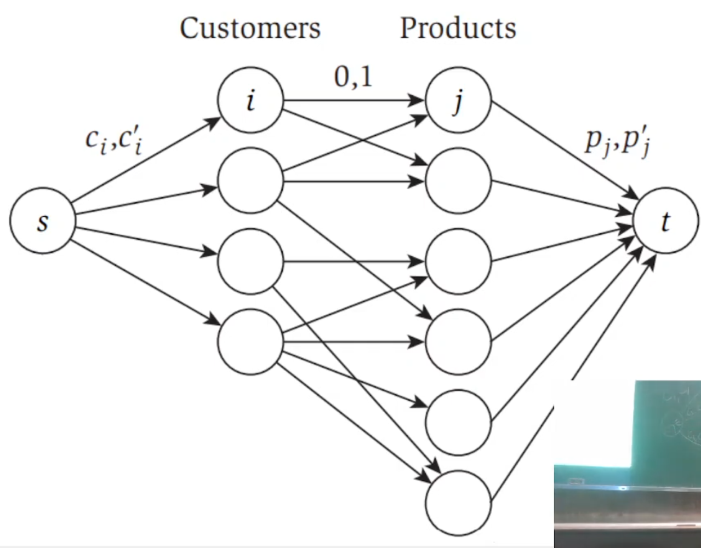

Conclusion: El grafo construido tiene una circulación factible sii se puede realizar la encuesta.

Ejemplo:

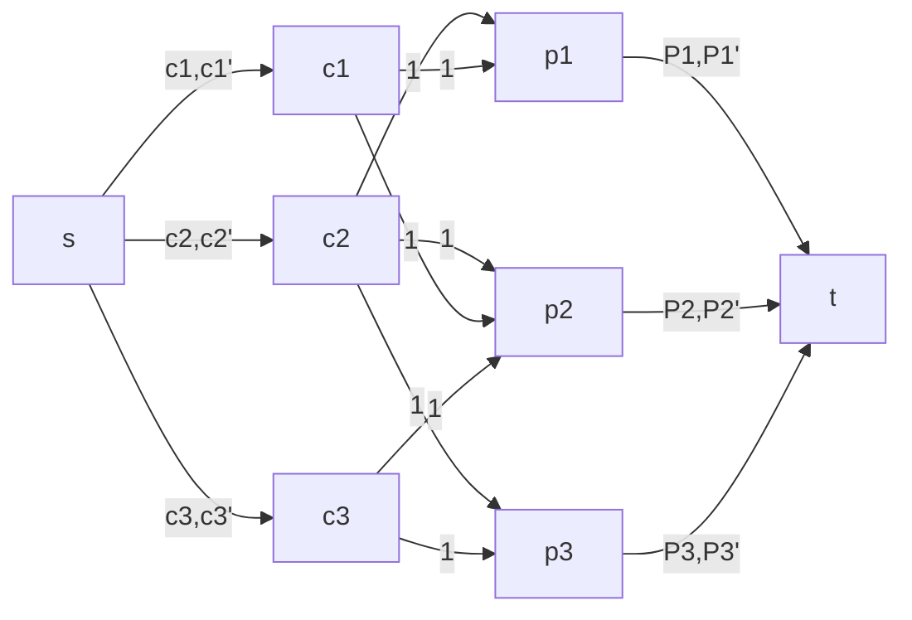
```mermaid
graph LR
    s -->|" c2,c2' "| c2 -->|1| p1 & p2 & p3
    s -->|" c1,c1' "| c1 -->|1| p1 & p2
    s -->|" c3,c3' "| c3 -->|1| p2 & p3
    p1 -->|" P1,P1' "| t
    p2 -->|" P2,P2' "| t
    p3 -->|" P3,P3' "| t
```

### Seleccion de proyectos

* P Conjunto de proyectos con precendencias.
* Cada proyecto tiene un costo o una ganancia.
* Cada proyecto i tiene un retorno economico $p_i$. Si es positivo, genera ganancia. Si es negativo, genera costo.
* Cada proyecto puede tener un subconjunto de problemas que deben ser resueltos para poder realizarlo.
* Nuestra idea es maximizar el retorno economico.

##### Podemos

Representar las relaciones entre proyectos como un grafo $G=(V,E)$

##### Cada proyecto i

Es un nodo $i \in V$

##### Cada proyecto j precede a i

Tiene una arista $(j,i) \in E$

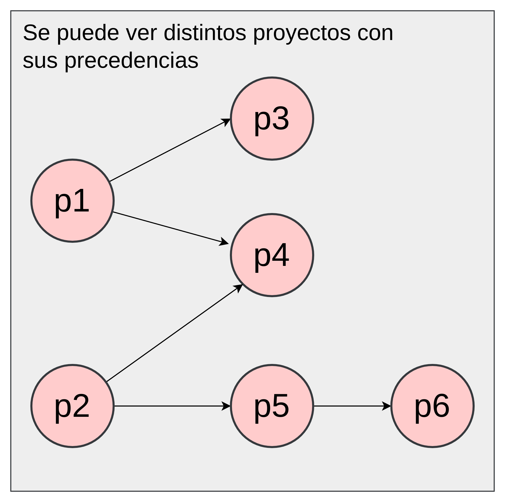

#### Factibilidad

Un subconjunto de proyectos $A \subseteq P$ es **factible** si los prerequisitos de cada proyecto en $A$, tambien estan
en $A$. Esto es, si el proyecto $i$ esta en $A$, entonces todos los proyectos $j$ tales que $(j,i) \in E$ tambien estan.

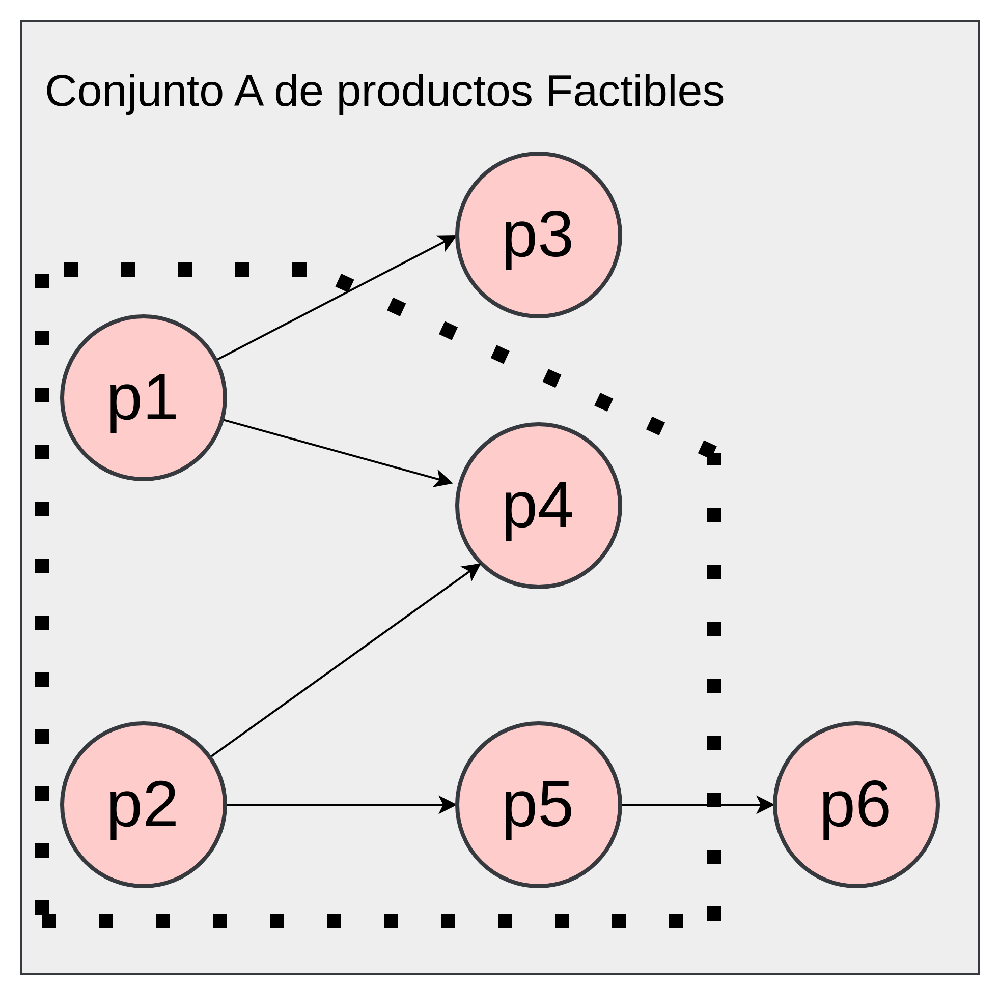

#### Ganancia

Dado un subconjunto de proyectos factibles $A$, $$ganancia (A) = \sum_{i \in A} p_i$$

Para todos los proyectos con retornos positivos llamaremos **tope** de ganancia a $$ C = \sum_{i/p_i > 0} p_i$$
Siendo la sumatoria de proyectos con retorno positivo. Este tope rara vez se consigue alcanzar.

#### Construccion de red

Agregamos:

* Un nodo `s` que es la fuente y un nodo `t` que es el sumidero.
* Un nodo por cada proyecto
* Por cada nodo $i$ con $p_i > 0$ agregamos una arista $(s,i)$ con capacidad $p_i$.
* Por cada nodo $i$ con $p_i < 0$ agregamos una arista $(i,t)$ con capacidad $-p_i$.

| i | 1  | 2  | 3 | 4 | 5 | 6  |
|---|----|----|---|---|---|----|
| p | -3 | -1 | 5 | 3 | 1 | -4 |

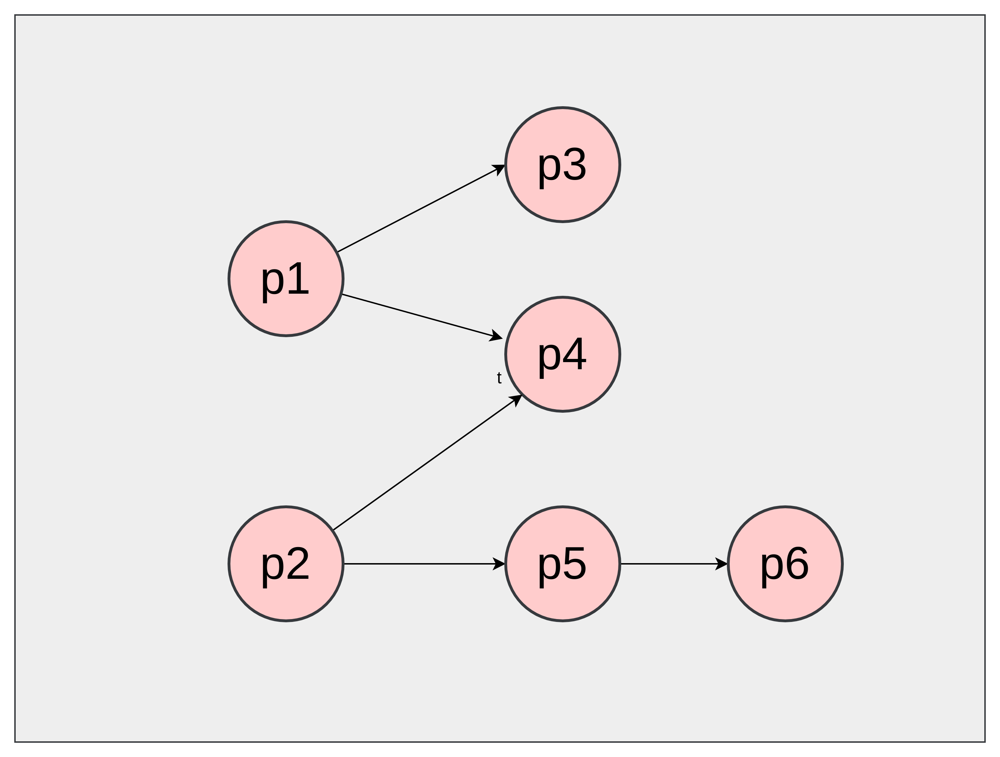

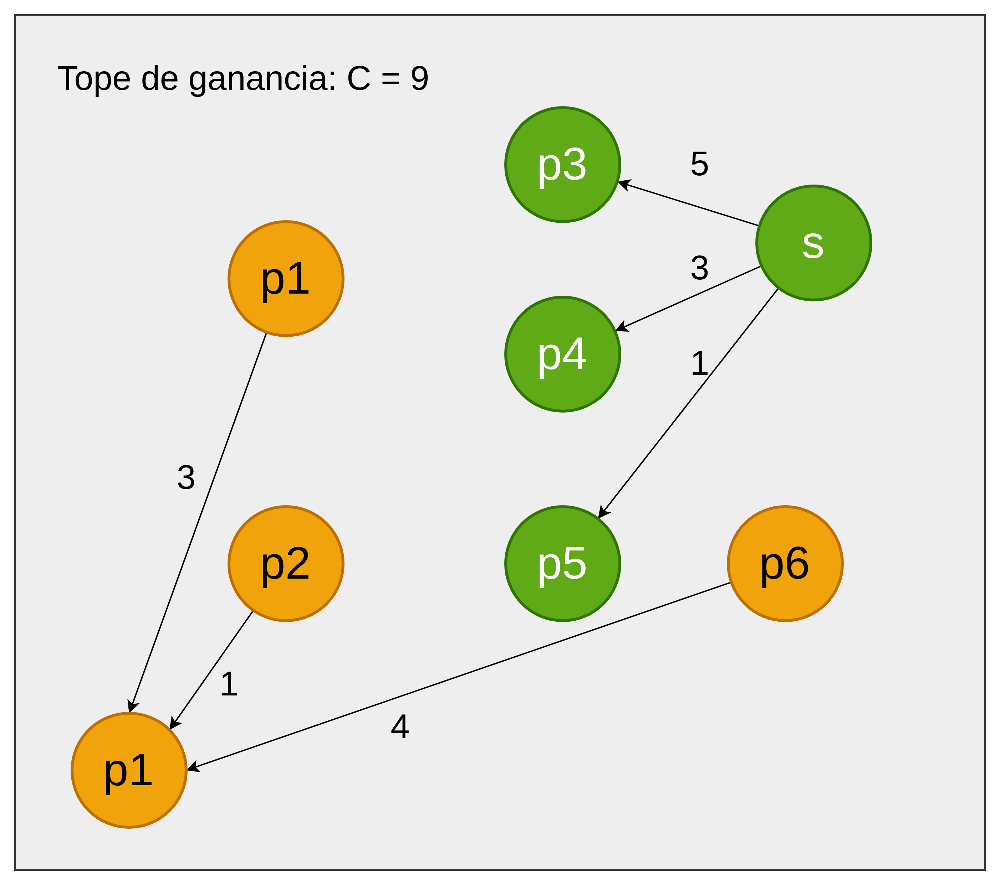

Finalmente:

* Por cada relacion $j$ que precede a $i$ agregamos una arista $(j,i)$ con capacidad $\inf$ o $C+1$. Esto es pues ningun
  corte minimo debe contener un eje con capacidad mayor a $C$. Estos se invierten pero siguen significando lo mismo:
  para hacer p3 previamente debo hacer p1.

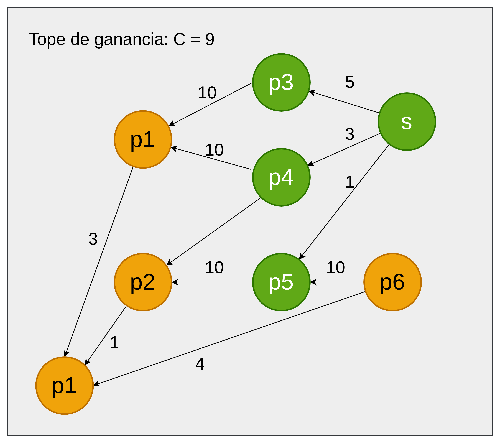

#### Afirmamos que el corte minimo s-t

es igual a la ganancia maxima posible.

Si llamamos $C(A', B')$ al corte minimo, entonces los proyectos en $A' - {s}$ son los proyectos a **ejecutar** para
maximizar la ganancia.

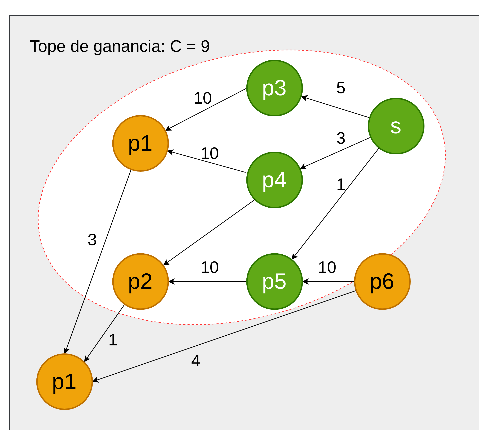

En este caso el corte minimo es $C(A', B') = 3 + 1 = 4$. Por lo que la ganancia maxima es 4. Para calcular el corte
minimo podemos resolver por FF y ver cuales son los nodos accesibles desde s: A' y los que no son accesibles desde s:
B'.

#### Analisis de la solucion

Sea $C(A',B')$ el corte minimo, si $A$ son los proyectos en el corte minimo, entonces $A'=A\cup \{s\}$
y $B' = (P - A) \cup \{t\}$.
Si P cumple las restricciones de precedencia el corte $C(A',B')$ no tendra ejes $(i,j)$ que crucen de $A'$ a $B'$. Esto
es pporque la capacidad de los ejes $i-j$ es mayor al corte $C(\{s\}, P\cup \{t\})$
