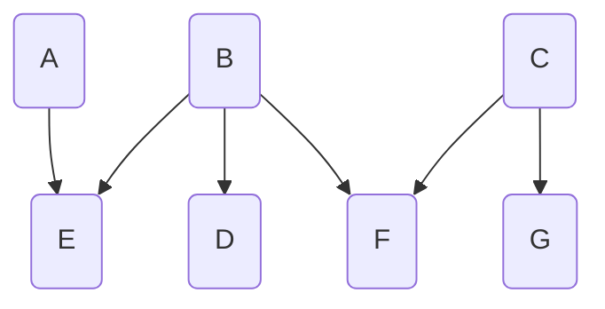
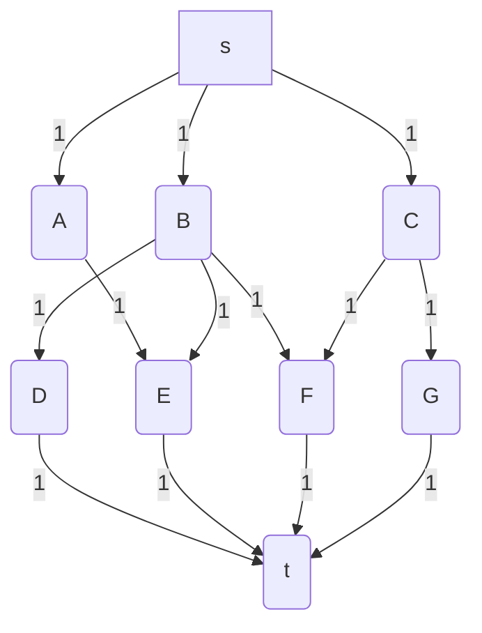
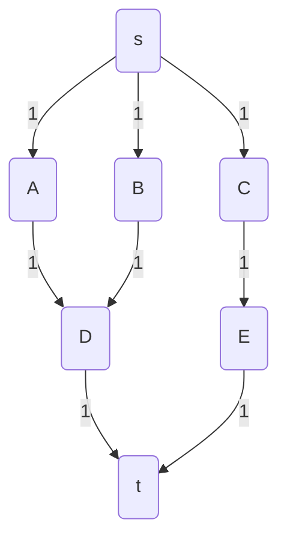
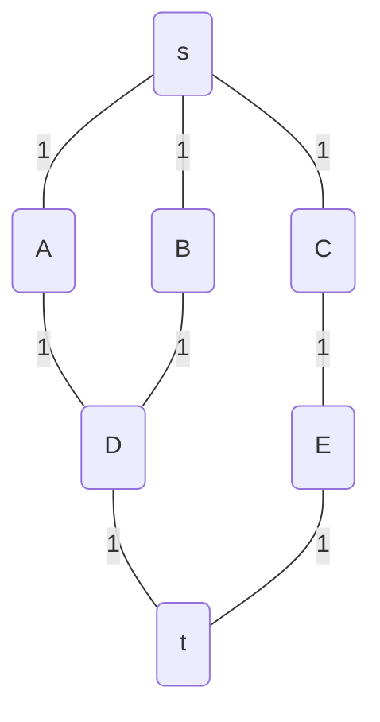
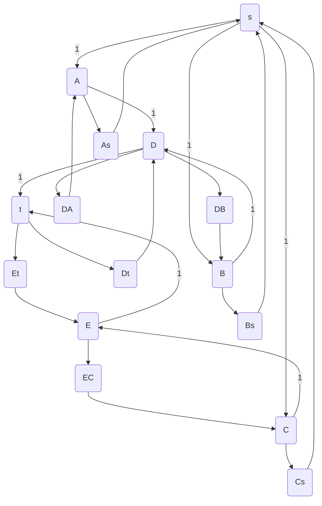
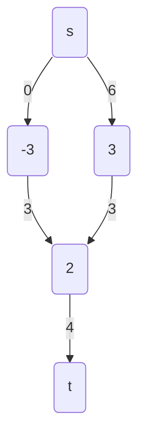
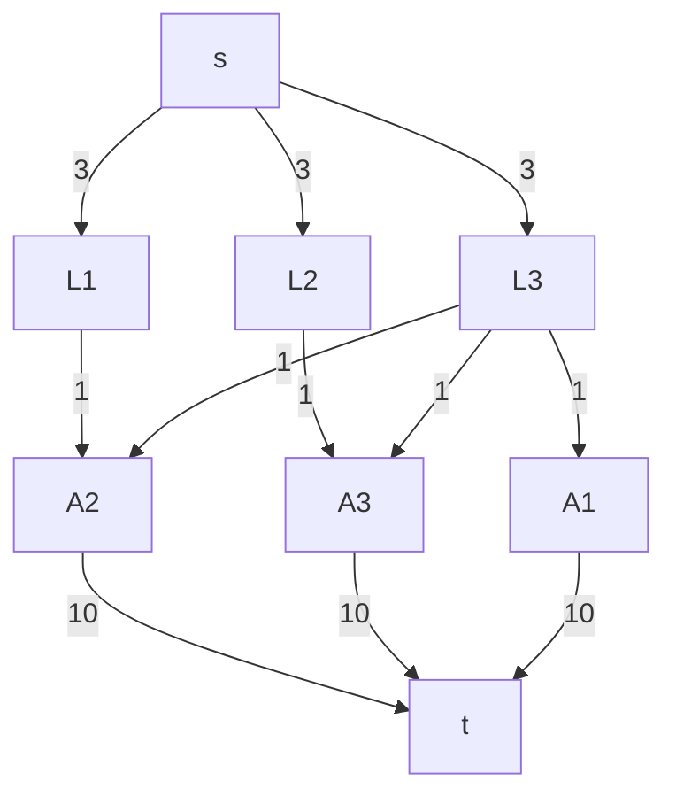
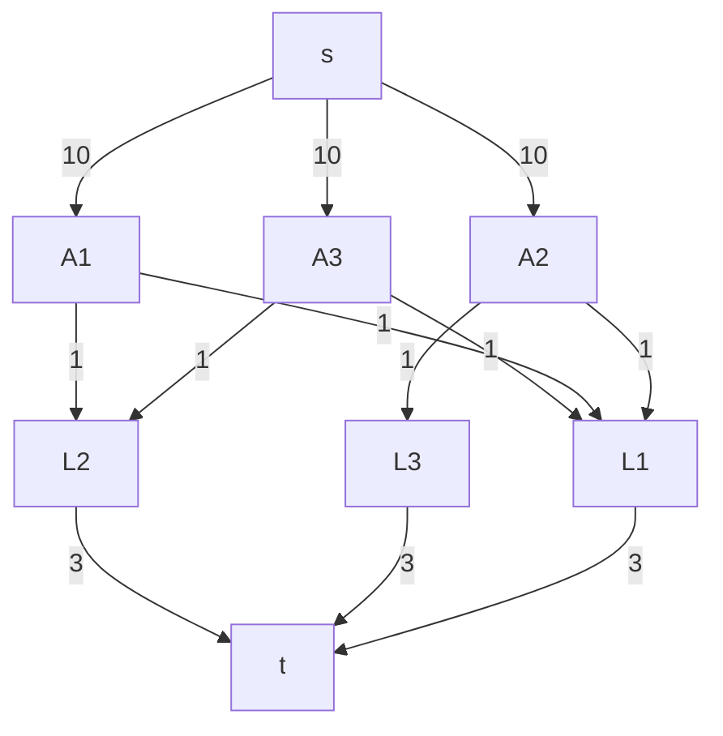

Dado un grafo no dirigido, un match es un subconjunto de las aristas en el cual para todo vértice V a lo sumo una arista
del match incide en V (en el match, tienen grado a lo sumo 1). Decimos que el vértice v está matcheado si hay alguna
arista que incida en él (sino, está unmatcheado). El matching máximo es aquel en el que tenemos la mayor cantidad de
aristas (matcheamos la mayor cantidad posible).

Con Ford Fulkerson tenemos tipicamente a $O(E \cdot V^2)$. Pero

Ver explicacion en clase

## Caminos disjuntos

Decimos que dos caminos son disjuntos si no comparten aristas (pueden compartir nodos).
Dado un grafo dirigido y dos vértices s y t, encontrar el máximo número de caminos disjuntos s-t en G.
Pro-tip: recuerden cómo funciona FF

Puedo usar FF para encontrar caminos disjuntos de forma progresiva. EN cada iteracion se encuentra el camino mas cercano
progresivamente usando BFS-FF. Luego, se bloquean (o *eliminan*) las aristas de ese camino y se vuelve a buscar otro
camino.

## Caminos disjuntos no dirigidas

Para caminos disjuntos no dirigidos, se fuerza al grafo a ser dirigido mientras sigue cumpliendo con las antiparalelas.

Del grafo:

Paso a:

Estrategia:
S para por algun vertice `u` aprovechando el camino de `u`->`v`.

## Circulaciones con demandas

Supongamos que tenemos varias "fuentes" con un suministro, y "sumideros" con una demanda. Ahora cada nodo tiene una
demanda (positiva, negativa o 0).

En grafos normales, **sin demanda**, teniamos que $f_{in}(v) - f_{out}(v) = 0$. Ahora deciemos que para grafos con
demandas, puede ocurrir que el nodo `u` tenga:
$f_{in}(u) - f_{out}(u) = d$. Lo que aparece dentro de cada nodo es lo que quiere consumir. Si aparece negativo, es
porque lo produce.

A produce 3.

## Ejercicio

Supongamos que tenemos un sistema de una facultad en el que cada alumno puede pedir hasta 10 libros de la biblioteca. La
biblioteca tiene 3 copias de cada libro. Cada alumno desea pedir libros diferentes. Implementar un algoritmo que nos
permita obtener la forma de asignar libros a alumnos de tal forma que la cantidad de préstamos sea máxima.

Modelo diciendo que cada libro puede ser prestado a lo sumo 3 veces. Cada alumno puede pedir hasta 10 libros. Cada libro
puede ser prestado a un alumno puntual 1 sola vez.

Alternativa:

Un grafo G tiene una circulación factible con demandas sii para todos los cortes (A, B): 
$$
\sum_{v \in B} d_v \leq c(A,B)
$$
