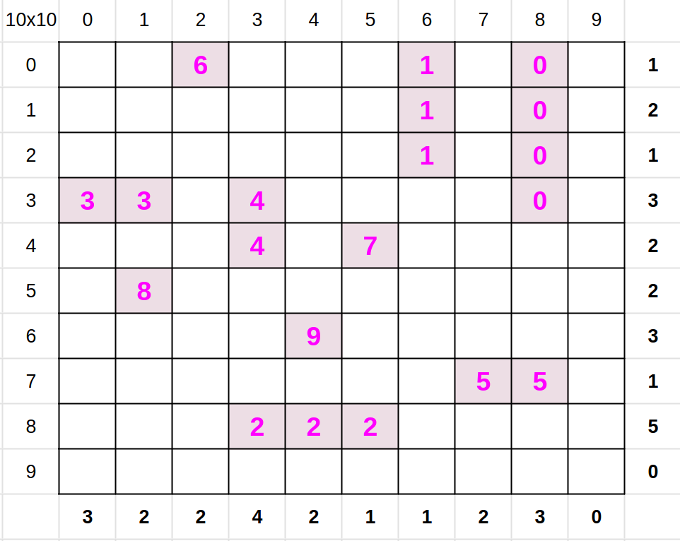

# Batalla Naval Individual

## Introducción

En dicho juego, tenemos un tablero de $n \times m$ casilleros, y $k$ barcos. Cada
barco $i$ tiene $b_i$ de largo. Es decir, requiere de $b_i$ casilleros para ser ubicado.
Todos los barcos tienen $1$ casillero de ancho. El tablero a su vez tiene un requisito de
consumo tanto en sus filas como en sus columnas. Si en una fila indica un $3$, significa
que deben haber $3$
casilleros de dicha fila siendo ocupados. **Ni más, ni menos**. No podemos poner dos
barcos de forma adyacente (es decir, no pueden estar contiguos ni por fila, ni por
columna, ni en diagonal directamente). Debemos ubicar todos los barcos de tal manera que
se cumplan todos los requisitos. A continuación mostramos un ejemplo de un juego resuelto:


## Consigna

Para los primeros dos puntos considerar la versión de decisión del problema de La Batalla
Naval: Dado un tablero de $n \times m$ casilleros, y una lista de $k$ barcos (donde el
barco $i$ tiene $b_i$ de largo), una lista de restricciones para las filas (donde la
restricción $j$ corresponde a la cantidad de casilleros a ser ocupados en la fila $j$)
y una lista de restricciones para las columnas (símil filas, pero para columnas), ¿es
posible definir una ubicación de dichos barcos de tal forma que se cumplan con las
demandas de cada fila y columna, y las restricciones de ubicación?

1. Demostrar que el Problema de la Batalla Naval se encuentra en NP.

Para demostrar que el problema se encuentra en NP (BN $\in$ NP), debemos demostrar que
para cualquier posible solución $S$ de cualquier instancia de BN, podemos verificar en
tiempo polinomial si $S$ es una solución válida de dicha instancia. Para ello, podemos
diseñar un _verificador eficiente_ que reciba como entrada la instancia de BN y la posible
solución $S$ y verifique si $S$ es una solución válida de dicha instancia. Es decir, si
cumple con las reglas del juego y responde con "si" a la version de decision del problema.

* Definimos a una instancia de BN con un tablero de $n \times m$ casilleros, una lista de
  de $k$ barcos donde cada barco $i$ tiene $b_i$ de largo, una lista de restricciones para
  las filas y una lista de restricciones para las columnas.
* $S$ consiste en una matriz $n \times m$ que contiene un numero $i$ en las celdas donde
  el barco $i$ esta ubicado en el tablero. Para verificar si $S$ es una solución debemos
  revisar si:
	1. Cada fila $j$ tiene barcos que ocupan exactamente $j$ casilleros
	2. Cada columna $j$ tiene barcos que ocupan exactamente $j$ casilleros
	3. No hay barcos adyacentes

Esto se puede lograr recorriendo la matriz $S$ y manteniendo en una lista de restricciones
para las filas y otra para las columnas, la cantidad de casilleros ocupados por cada fila
y columna. Si en alguno de ellos se excede la cantidad de casilleros o si no se llega a la
cantidad de casilleros requeridos

```python
def hay_otro_barco_adyacente(S, f, c, k):
    # funcion que verifica si hay un barco adyacente
    vecinas = [(f, c + 1), (f + 1, c - 1), (f + 1, c), (f + 1, c + 1)]
    for vf, vc in vecinas:
        if not (0 <= vf < len(S) and 0 <= vc < len(S[0])):
            continue
        if S[vf][vc] != -1 and S[vf][vc] != S[f][c]:
            return True
    return False


def verificador(S, filas, columnas, barcos):
    # Recorrer la matriz S
    n = len(S)
    m = len(S[0])
    k = len(barcos)

    if len(filas) != n or len(columnas) != m:
        return False

    for f in range(n):
        for c in range(m):
            if S[f][c] == -1:
                # si no hay barco en esa posicion, sigo con la siguiente casilla
                continue
            if S[f][c] >= k:
                # si el barco en esa posicion no es valido
                return False
            if filas[f] == 0 or columnas[c] == 0 or barcos[S[f][c]] == 0:
                # si no hay mas casilleros para ocupar en esa fila o columna
                return False
            if hay_otro_barco_adyacente(S, f, c, k):
                # si hay un barco adyacente
                return False
            barcos[S[f][c]] -= 1
            filas[f] -= 1
            columnas[c] -= 1

    return not any(filas) and not any(columnas) and not any(barcos)
```



2. Demostrar que el Problema de la Batalla Naval es, en efecto, un problema NP-Completo.
   Si se hace una reducción involucrando un problema no visto en clase, agregar una (al
   menos resumida) demostración que dicho problema es NP-Completo. Para esto, recomendamos
   ver ya sea los problemas 3-Partition o Bin-Packing, ambos en su versión unaria. Si bien
   sería tentador utilizar 2-Partition, esta reducción no sería correcta. En caso de
   querer saber más al respecto, consultarnos :-)

## 2-Partition

Given integers $A = {a_1, a_2, ..., a_n}$, is there a partition of $A$ into two subsets
such that the sum of the integers in each subset is the same?

So A partitions into $A_1 \cup A_2$ such
that $\sum_{a_i \in A_1} a_i = \sum_{a_i \in A_2} a_i = \sum_{a_i \in A} a_i / 2 $

Gerenalization: Subset Sum Given $ A = {a_1, a_2, ..., a_n}$ and an integer $K$, is there
a subset $S \subseteq A$ such that $\sum_{a_i \in S} a_i = K$?

## 3-Partition

Given integers $A = {a_1, a_2, ..., a_n}$ partition A into $\frac{n}{3}$
sets $A_1 \dot{\cup} \dots \dot{\cup} A_{\frac{n}{3}} = A$ of equal sum:

$$ \sum_{a_i \in A_1} a_i = \sum_{a_i \in A_2} a_i = \dots = \sum_{a_i \in A_{\frac{n} {3}}} a_i = \sum_{a_i \in A} a_i / \frac{n}{3} = t$$
Equivalente notation:
$$ \sum A_i = \sum A/ \frac{n}{3} = t$$

* Can assume each $a_i \in (\frac{t}{4}, frac{t}{2}$
* |A_i| = 3
* Could add $\infty$ to each $a_i$

## Numerical 3-dim matching
