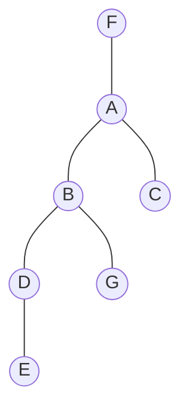

# Parcial 2024 1C

## Dominating Set

Un set dominante (Dominating Set) de un grafo $G$ es un subconjunto $D$ de vértices de $G$, tal que todo vértice de $G$
pertenece a $D$ o es adyacente a un vértice en $D$. El problema de decisión del set dominante implica, dado un grafo $G$
y un número $k$, determinar si existe un set dominante de a lo sumo tamaño $k$.

# 1. NP: Hitting Set Problem

El _Hitting Set Problem_ es: Dado un conjunto $A$ de $n$ elementos, $m$ subconjuntos $B_1, B_2, \dots, B_m$
de $A$ ($B_i \subseteq  A \forall i$), y un número $k$, ¿existe un subconjunto $C \subseteq A$ con $|C| \leq k$ tal
que $C$ tenga al menos un elemento de cada $B_i$ (es decir, $C \cap B_i \neq ∅$)?

Problema de decisión:
> Existe un subconjunto de A de a lo sumo tamaño k que intersecta a todos los B_i? (que tenga al menos un elemento de
> cada B_i)

Demostrar que el _Hitting Set Problem_ es NP-completo utilizando Dominating Set.

1. Probar que _Hitting Set Problem_ está en NP.
   Para esto se debe crear un verificador eficiente que reciba una solución candidata de $k$ elementos y verifique en
   tiempo polinomial si es una solución válida para HS. Deberia revisar:
    * Al menos un elemento de C, este en B_i para todo $i$.

   ```python
   def verificador(C, B):
       for i in range(len(B)):
           for b in B[i]:
               if b in C:
                   break
           else:
               return False
       return True
   ```

   Este verificador tiene Complejidad $O(m \cdot n)$, donde $m$ es la cantidad de subconjuntos y $n$ la cantidad de
   elementos en $A$.

2. Probar DS $\leq_p$ HS. Es decir, que podemos reducir el problema de Dominating Set a Hitting Set. Esto para concluir
   que HS es NP-completo.

   Sea $G = (V, E)$ un grafo y $k$ un entero, queremos llevar esta intancia de
   DS a una instancia _equivalente_ de HS. De modo tal que si el problema de decision arroja una respuesta de "SI" para
   HS, entonces es "SI" para DS y viceversa. Para esto podemos:

    * Para cada vertice $i$ en $G$, creamos un elemento $a_i$ en $A$.
    * Para cada vertice $i$ en $G$, creamos un subconjunto $B_i$ en $B$ con los vecinos de $i$ y $a_i$ incluido.

Decimos que:

* A) Si existe un set dominante de tamaño $k$ en $G$, entonces existe un hitting set de tamaño $k$ en $HS$.
* B) Si existe un hitting set de tamaño $k$ en $HS$, entonces existe un set dominante de tamaño $k$ en $G$.

Demostración:

* QUEDA PENDIENTE, no me da tiempo a estudiar :p

# Greedy: Dominating Set

Implementar un algoritmo greedy que permita obtener el Dominating Set mínimo (es decir, que contenga la menor
cantidad de vértices) para el caso de un árbol (en el contexto de teoría de grafos, no un árbol binario). Indicar y
justificar la complejidad del algoritmo implementado. Justificar por qué se trata de un algoritmo greedy. Indicar si el
algoritmo siempre da solución óptima. Si lo es, explicar detalladamente, sino dar un contraejemplo.

En teoría de grafos, un árbol es un grafo en el que cualquier par de vértices están conectados por exactamente un
camino, o alternativamente, es un grafo conexo acíclico.



Para el grafo anterior, un Dominating Set mínimo sería {A, B, G} de tamanio 3.

Estrategia greedy para minimizar el Dominating Set:

El algoritmo es greedy porque en cada paso toma decisiones localmente óptimas sin retroceder:

Identifica las hojas del árbol
Para cada hoja, selecciona su padre para el dominating set
Elimina las hojas y sus padres
Repite el proceso

```python
```

